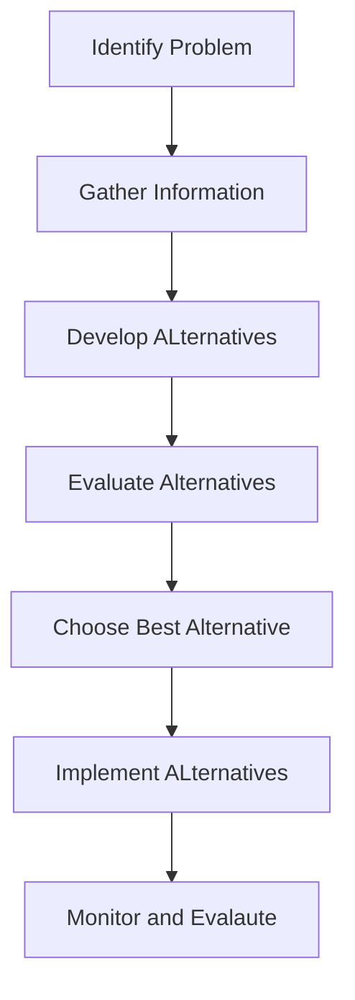
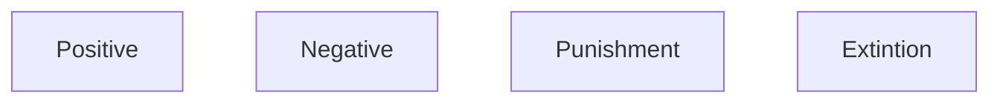
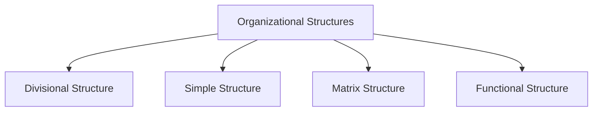
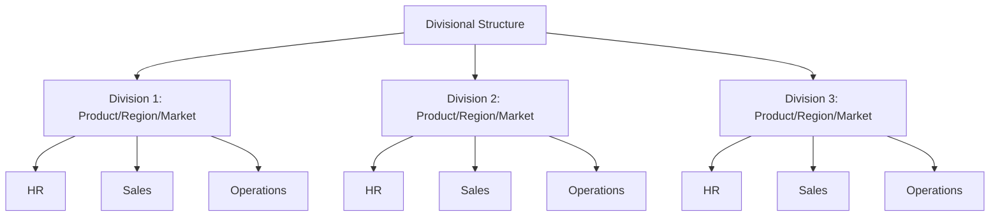
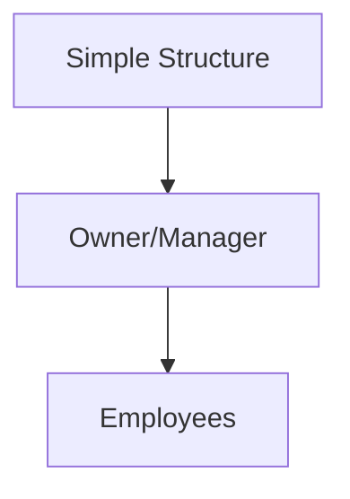
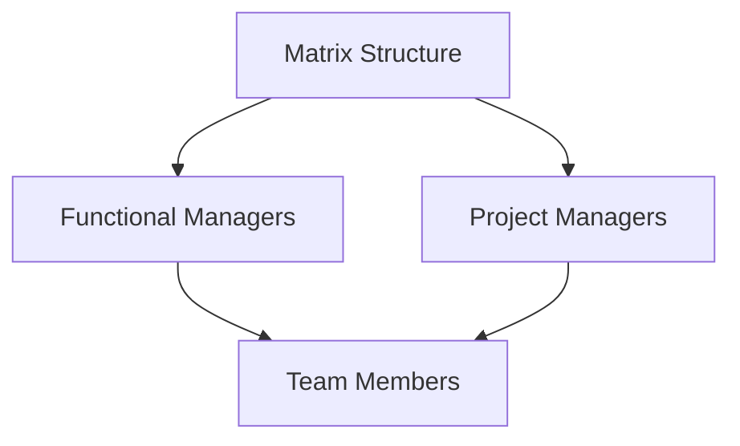
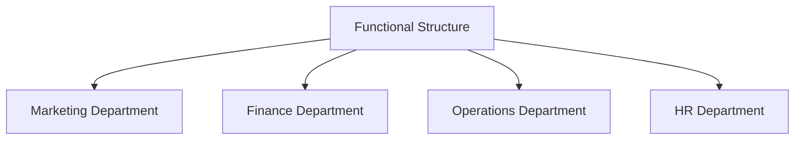

# Decision-Making

I G D E C I M
# Reinforcement
A concept in behavior management that refers to the process of encouraging or discouraging a behavior b using consequences - it's widely used in OB and management to motivate employees and shape desired behavior.

**Positive** - Providing a positive stimulus to reward good behavior
**Negative** - Removing a negative stimulus to reward good behavior
**Punishment** - Providing unpleasant stimulus to discourage bad behavior
**Extinction** - Removing positive stimulus to discourage bad behavior'

# Business Ethics
refers to the principles, standards and norms that guide behavior in the business world. It involves applying moral values and ethical reasoning to business decisions and practices. They ensure:
- Fairness
- Accountability
- Responsibility
- Integrity
- Transparency

### Importance
1. Building Trust and Reputation
2. Ensuring Legal Compliance
3. Attracting and Retaining Talent
4. Ensuring Consumer Loyalty
5. Fostering Long Term Success
6. Mitigating Risks
7. Contributing to Society

# Leadership Grid
**Robert Blake & Jane Mouton**

People = Y axis
Production = X axis

| **Country Club Management** |                    | **Team Management**          |
| ----------------------- | ------------------ | ------------------------ |
|                         | **Middle of the Road** |                          |
| **Impoverished Management** |                    | **Authoritative Management** |

# Group Dynamics
**Kurt Lewin**
refer to the interactions, processes, and behaviors that occur within a group as members work together toward a common goal. it examines how individuals in a group influence and are influenced by each other, how roles and relationships develop, and how the group functions as a unit.

Key Elements:
1. Group Formation
2. Rules and Norms
3. Group Cohesion
4. Leadership
5. Conflict & Resolution

Types:
1. Formal
2. Informal

Importance:
1. Enhances Collaboration
2. Improves Decision-Making
3. Identifies Issues
4. Increases Productivity
5. Facilitates Change

## Group Forming:
1. Forming
2. Storming
3. Norming
4. Performing
5. Adjourning

# Administrative Theory
**Henry Favol**
is the earliest theory of management that focuses on the organization as a whole. He introduces this for managerial practices, outlining how management should function and emphasizing the importance of planning, organizing, leading and controlling within an org.

Classical Administrative Theory Principles
1. Division of Work
2. Authority and Responsibility
3. Discipline
4. Unity of Command
5. Unity of Direction
6. Subordination of Individual Interests to General Interest
7. Renumeration
8. Centralization
9. Scalar Chain
10. Order
11. Equity
12. Stability of Tenure
13. Initiative
14. Esprit de Corps

## Hawthorne's Experiments

- Conducted by Elton Mayo in the Western Electric Company in the 12920s and 30s.
1. Social Factors Influence Productivity
	1. Esprit de corps
	2. Equity
2. Importance of Informal Groups
	1. Discipline
	2. U Direction
3. Employee Participation and Engagement
	1. Initiative
	2. Authority
4. Psychological Contract
	1. Equity
	2. Stability
5. Motivation beyond monetary rewards
	1. remuneration
6. Supervisor's role in productivity
	1. Unity of command
	2. Order

S I E P M S
Electric = Siemens = S I E P M S

# Theories
## 1. Classical
- industrial revolution
- efficiency maximization
1. Scientific - Frederick Taylor
	1. Scientific Analysis
	2. Selection and Training
	3. Standardization
	4. Performance based compensation
2. Administrative - Henry Favol -  D A D U U S R C S O E S I E
	1. Division
	2. Authority
	3. Discipline
	4. Command
	5. Direction
	6. Scalar Control
	7. Remuneration
	8. Centralization
	9. Standardization
	10. Order
	11. Equity
	12. Subordination
	13. Initiative
	14. Esprit de corps
3. Bureaucratic - Max Webber
	1. Forman Hierarchy
	2. Division of labor and specialization
	3. Rules and Regulation of governance
	4. Personality in decision-making

## 2.Neo Classical
- emphasized the importance of human relations and social factors

1. Elton Mao
	1. harthorne Studies
	2. Emphasized the importance of comms, ledership, and morale
2. Abraham Maslow
	1. Needs:
		1. Physiological
		2. Safety
		3. Social
		4. Esteem
		5. Self Actualization
	2. McGregor's X and Y

## 3. Contingency
- No universal management
- adaptation to env factors
- flexibility and responsiveness
- task and leadership contingency

| Aspect              | Classical                | Neo Classical           | Contingency                  |
| ------------------- | ------------------------ | ----------------------- | ---------------------------- |
| Focus               | Efficiency and Structure | social and motivation   | adaptability and flexibility |
| View of Employees   | Mechanistic              | human centerd           | contextual                   |
| Leadership          | top-down hierarchical    | participative           | flexible                     |
| Management Approach | authoritative            | social and phycological | situational                  |

# Functions of Management

1. Planning
	1. Setting Objectives
	2. Strategic planning
	3. Tactical Planning
	4. Operational Planning
2. Organizing
	1. Division of work
	2. Eshtablishing Rules and Protocols
	3. Resource Allocation
	4. Coordination
3. Leading
	1. Motivation
	2. Communication
	3. Leadership
	4. Decision-Making
4. Controlling
	1. Eshtablishing Standards
	2. Measuring Performance
	3. Identifying Deviations
	4. Corrective Actions

# Organizational Structure

## Factors to Consider
1. Objectives and Goals
2. Nature of Business
3. Strategy
4. Size of Organization
5. Environment
6. Technology
7. Workforce
8. Geographic Spread
9. Decision-Making Process
10. Resources and Budget
11. Organizational Culture
12. Legal and Regulatory Requirements

# OB
is the study of how individuals, groups, and structures affect and are affected by behavior within organizations. Its primary ain is to apply such knowledge toward improving an organization's effectiveness

Nature - I D G F S H 
- Interdisciplinary
- Dynamic
- Focus on Behavior
- Science and Art
- Human Centric
- Goal-Oriented

Scope: I G O I D W
- Individual Behavior
- Group Behavior
- Organizational Aspects
- Interpersonal Relations
- Dynamics of Change
- Work Environment

Importance I P H D
- Enhances understanding of workforce diversity
- Improves decision-making process
- Promotes better communication and leadership
- Helps in managing conflict and stress
- Drives employee motivation and performance

