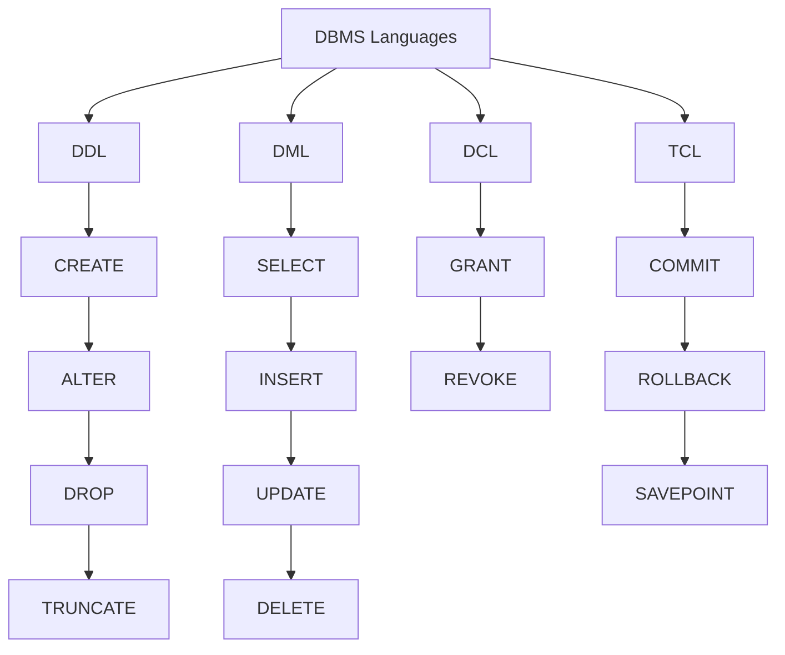

# File System v/s DBMS
## DDR AC IQ BRS

| Feature                 | File System                         | DBMS                                 |
| ----------------------- | ----------------------------------- | ------------------------------------ |
| **Definition**          | Manages individual files on storage | Manages Structured databases         |
| **Data Management**     | Individual Files                    | Structured databases with tables     |
| **Redundancy Control**  | High redudancy and inconsistency    | Reduces redundancy and inconsistency |
| **Data Integrity**      | Limited Support                     | Enforces rules                       |
| **Access Control**      | Basic permissions                   | Defines user roles                   |
| **Query Processing**    | Manual and Sequential               | SQL                                  |
| **Concurrency Control** | Limited or none                     | Mechanisms to hanfle concurrency     |
| **Backup and Recovery** | Manually Done                       | Automatable                          |
| **Data Relationships**  | No inherent support                 | Inherent support for relation        |
| **Scalability**         | Less scalable                       | Highly scalable                      |

# DBMS Languages

## Data Definition Language
DDL is used to define and manage database structures such as schemas, tables, and indices.
- **CREATE:** create new objects like tables or rows
- **ALTER:** Modify structure of existing db object
- **DROP:** Delete db objects
- **TRUNCATE:** Remove all records from the table, but keep the table

## Data Manipulation Language
DML is used to retrieve, insert, update and delete data in a database
- **SELECT:** used to retrieve data from a database
- **INSERT:** used to add new rows into a table
- **UPDATE:** Used to modify existing values in a table
- **DELETE:** Used to remove rows from a table

## Data Control Language
Used to control Access to data within a database
- **GRANT**
- **REVOKE**

## Transaction Control Language
Used to manage transactions and ensure data integrity
- **COMMIT:** Used to save all changes made in the current transaction
- **ROLLBACK:** Used to undo changes made in the current transaction
- **SAVEPOINT:** Used to set a savepoint in the middle of a transaction

