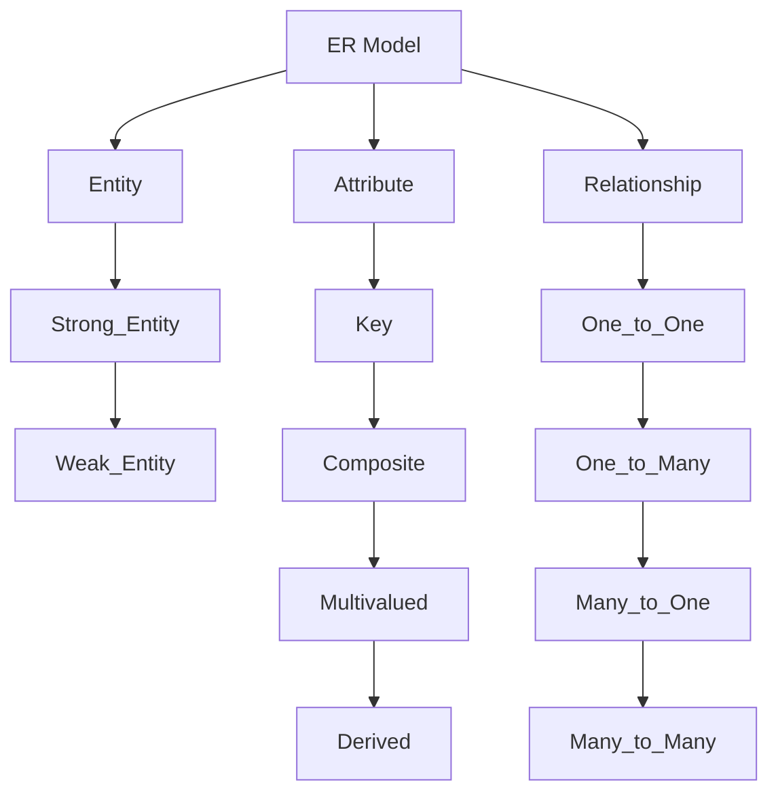

# Database Design
## RCLPITM
Roti Curry Laddu Puri Idli Taravata Masala Dosa
1. Requirement Analysis
	- Identify Purpose of the Database
	- Collect and analyze user requirements
	- Define the Scope of the Database
	- Document the data to be stored and its relationships
2. Conceptual Design
	- Create a high-level model if the data and the relationships
	- Develop an ER Model
	- Define entities, attributes and Relationships
	- Ensure the model rules align with the requirements
3. Logical Design
	- Transform the conceptual model into a logical schema
	- Normalize the data to reduce redundancy
	- Define Tables, columns, and keys
	- Create a data dictionary
4. Physical Design
	- Choose a DBMS
	- Translate the logical schema to the physical schema
	- Define storage structures and access methods
	- Consider Indexing, portioning and clustering
5. Implementation
	- Create the database using SQL 
	- Implement tables, constraints and relationships
	- Develop stored procedures, triggers and views
	- Set up user accounts and permission
6. Testing
	- Verify the data integrity consistency
	- Test database performance under various loads
	- Optimize queries and indices
	- Ensure the database meets all requirements
7. Maintenance and Evolution
	- Monitor database performance and usage
	- Perform regular backups and maintenance tasks
	- Update the database schema as per changes
	- Optimize and tune the database periodically

# ER Model

| Figure           | Represents              |
| ---------------- | ----------------------- |
| Rectangle        | Entities                |
| Ellipse          | Attributes              |
| Diamond          | Relationships           |
| Line             | Attributes -> Entities  |
| Double Ellipse   | Multi-Values Attributes |
| Double Rectangle | Weak Entity             |

ER - Entity Relationship E ante EA Ante Attribute