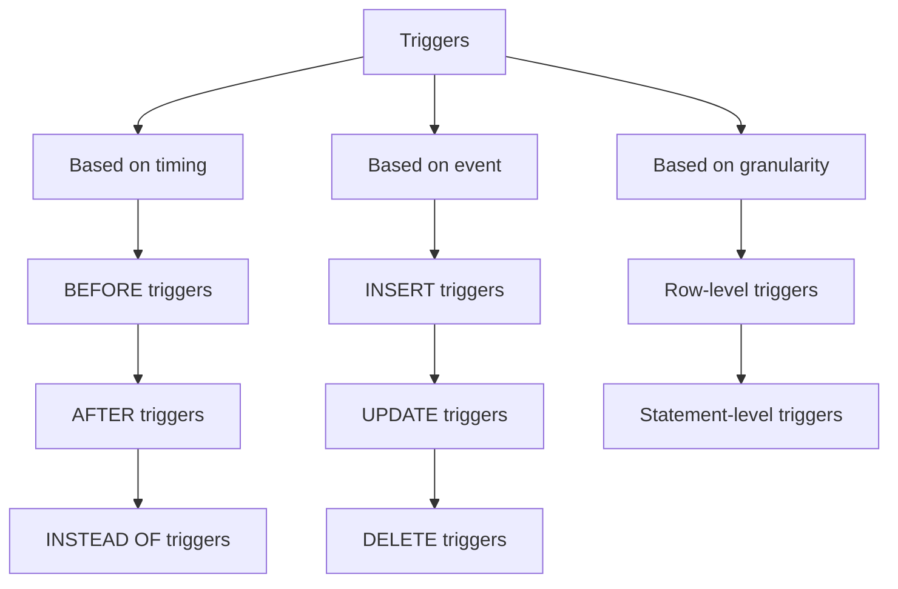
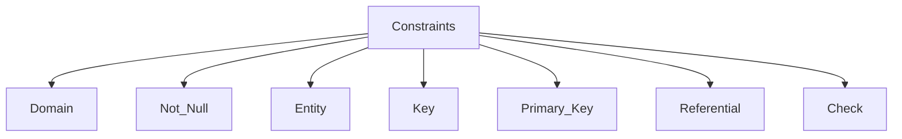

# Views
They are virtual tables derived from one or more actual tables or views in a database
It is a named query stored in the database, and it appears and functions as a table but does not store any data
It is read only and dynamically reflect the tables or views its based on 
It is used to simplify data retrieval and enhance security by restricting access to certain data
Simple views are based on a single table
complex views are based on multiple tables or other views
They provide a layer of data abstraction and added security, and simplifies querying the database
Syntax:
```sql
CREATE VIEW view_name AS
SELECT column1, column2, ...
FROM table_name
WHERE condition;
```
They can be queried like a regular table and are often used in `SELECT` statements

# UNION
This keyword is used to combine the result sets of two or more `SELECT` Statements
- It combines the results of two or more `SELECT` statements
- It removes duplicate rows from the combines result set
- The number and order of columns must be the same in all the `SELECT` statements
- The data types also must be compatible
Syntax:
```SQL
SELECT ID, NAME, DEPARTMENT FROM EMPLOYEES_HYD
UNION
SELECT ID, NAME, DEPARTMENT FROM EMPLOYEES_BLR;
```

# INTERSECT
This keyword is used to only return the rows present in common between two or more `SELECT` statements
- It returns only the distinct rows
- Like union, the number of columns returned, and the data types should be the same
- It is less commonly supported

Syntax:
```SQL
SELECT NAME, CITY FROM EMPLOYEES_SALES
INTERSECT
SELECT NAME, CITY FROM EMPLOYEES_MARKETING;
```

# Triggers
They are special type of stored procedures in a database that automatically execute when specific events occur. 
They're used to maintaining data integrity, enforce rules, and automate certain operations.

- They are `Event-Driven`
- They get executed automatically when said event occurs
- They operate on a specific table
- Used for Auditing, validating, and maintaining data

There are three different classification of triggers:
1. Based on Timing
	1. BEFORE
	2. AFTER
	3. INSTEAD OF
2. Based on event:
	1. INSERT
	2. UPDATE
	3. DELETE
3. Based on Granularity
	1. Row-Level
	2. Statement-Level



```SQL
CREATE OR REPLACE FUNCTION notify_customer_insert()
RETURNS TRIGGER AS $$
BEGIN
    RAISE NOTICE 'New customer inserted!';
    RETURN NEW;
END;
$$ LANGUAGE plpgsql;

CREATE TRIGGER after_customer_insert
AFTER INSERT ON customers
FOR EACH ROW
EXECUTE FUNCTION notify_customer_insert();
```

# Constraints
## Domain
- Define the allowable data type for a given column
## Not Null
- Ensure that a column cannot have NULL vales
## Entity
- Each row in a table is uniquely identifiable through a primary key
## Key
- Primary Key
- Unique Key
- Foreign Key
## Primary Key
- Designate a column as the unique identifier for a row
## Referential
- Maintain consistency between related tables
## Check
- only allow certain data to be inserted with a condition



