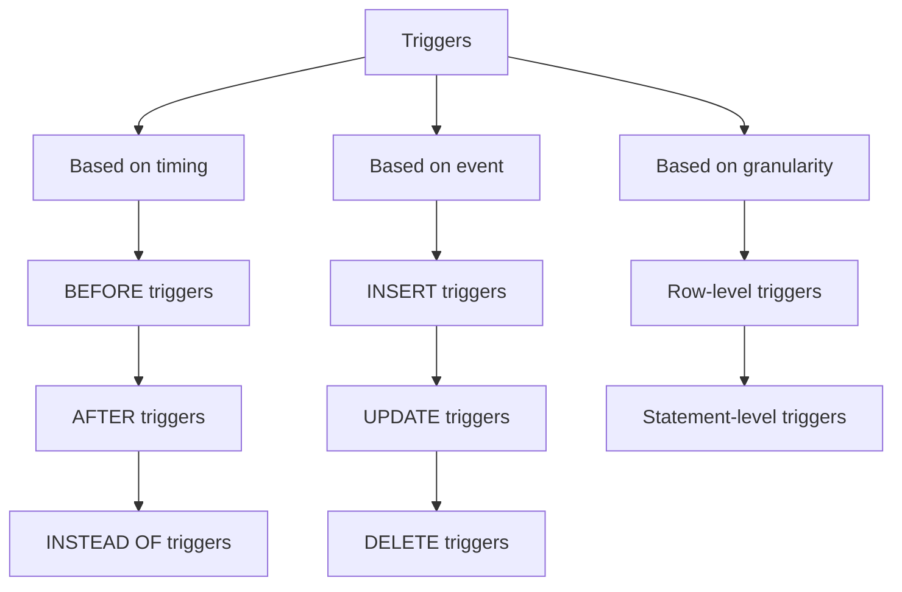
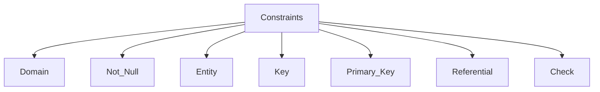

# Views
They are virtual tables derived from one or more actual tables or views in a database
It is a named query stored in the database, and it appears and functions as a table but does not store any data
It is read only and dynamically reflect the tables or views its based on 
It is used to simplify data retrieval and enhance security by restricting access to certain data
Simple views are based on a single table
complex views are based on multiple tables or other views
They provide a layer of data abstraction and added security, and simplifies querying the database
Syntax:
```sql
CREATE VIEW view_name AS
SELECT column1, column2, ...
FROM table_name
WHERE condition;
```
They can be queried like a regular table and are often used in `SELECT` statements

# UNION
This keyword is used to combine the result sets of two or more `SELECT` Statements
- It combines the results of two or more `SELECT` statements
- It removes duplicate rows from the combines result set
- The number and order of columns must be the same in all the `SELECT` statements
- The data types also must be compatible
Syntax:
```SQL
SELECT ID, NAME, DEPARTMENT FROM EMPLOYEES_HYD
UNION
SELECT ID, NAME, DEPARTMENT FROM EMPLOYEES_BLR;
```

# INTERSECT
This keyword is used to only return the rows present in common between two or more `SELECT` statements
- It returns only the distinct rows
- Like union, the number of columns returned, and the data types should be the same
- It is less commonly supported

Syntax:
```SQL
SELECT NAME, CITY FROM EMPLOYEES_SALES
INTERSECT
SELECT NAME, CITY FROM EMPLOYEES_MARKETING;
```

# EXCEPT
It is used to only return the rows of one query which are not present in another query
Syntax:
```SQL
SELECT COL1, COL2
FROM TABLE1
EXCEPT
SELECT COL1, COL2
FROM TABLE2
```
- This will return the rows of table1 out of columns 1 and 2 making sure they are not present in table 2
- It only returns distinct rows, removing any duplicates
- The order matters it is always A EXCEPT B and not B EXCEPT A
- NULL values are treated as equal by SQL
# Triggers
They are special type of stored procedures in a database that automatically execute when specific events occur. 
They're used to maintaining data integrity, enforce rules, and automate certain operations.

- They are `Event-Driven`
- They get executed automatically when said event occurs
- They operate on a specific table
- Used for Auditing, validating, and maintaining data

There are three different classification of triggers:
1. Based on Timing
	1. BEFORE
	2. AFTER
	3. INSTEAD OF
2. Based on event:
	1. INSERT
	2. UPDATE
	3. DELETE
3. Based on Granularity
	1. Row-Level
	2. Statement-Level



```SQL
CREATE OR REPLACE TRIGGER C1
BEFORE INSERT ON Customer
FOR EACH ROW
BEGIN
	IF :NEW.ID > 1000 THEN
		RAISE_APPLICATION_ERROR(-200001, 'Too many customers')
	END IF;;
	Dbms_output.out_line('New Customer Added!')
END;
```

# Constraints
## Domain
- Define the allowable data type for a given column
## Not Null
- Ensure that a column cannot have NULL vales
## Entity
- Each row in a table is uniquely identifiable through a primary key.
## Key
- Primary Key
- Unique Key
- Foreign Key
## Primary Key
- Designate a column as the unique identifier for a row
## Referential
- Maintain consistency between related tables
## Check
- only allow certain data to be inserted with a condition



# Nested and Correlated
- Also called sub queries, they are queries embedded within another query.
- The outer query is called the main query, and the inner query is called the sub-query
- Used in `SELECT INSERT UPDATE DELETE` statements
- They can return a single value or a set of values
- The sub-query is executed first, and the result of the sub-query is used in the main query
Syntax:
```SQL
SELECT employee_name
FROM employees
WHERE department_id IN (
    SELECT department_id
    FROM departments
    WHERE location = 'New York'
);
```

- Correlated queries are a specific type of nested query where the sub-query depends on the outer query for its values
- The sub-query is executed for each row the outer query returns
- It is independent on the outer query
- Slower to execute as it is iterative
- used for row operations or comparisons

Syntax:
```SQL
SELECT e.employee_name, e.salary
FROM employees e
WHERE e.salary > (
    SELECT AVG(salary)
    FROM employees
    WHERE department_id = e.department_id
);
```

# Query
Sailors Boats Reserves:
Return the names of sailors who reserved all the boats:
```sql
SELECT s.sailor_id, s.sailor_name
FROM sailors s
WHERE NOT EXISTS (
    SELECT b.boat_id
    FROM boats b
    WHERE NOT EXISTS (
        SELECT r.boat_id
        FROM reservations r
        WHERE r.sailor_id = s.sailor_id
        AND r.boat_id = b.boat_id
    )
);
```


