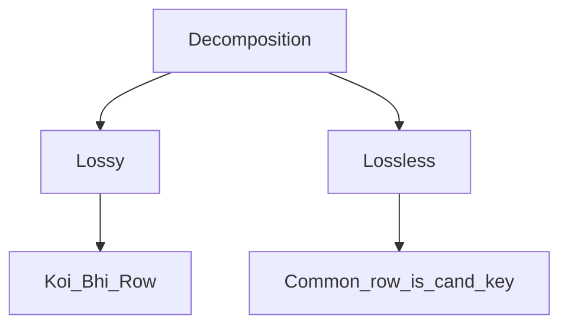

# Normalization
DB Normalization is a process in DB Design that organizes tables of minimize redundancy and dependency.
The main goal is to ensure that data is logically stored to reduce the chance of data anomalies.
Goals:
1. **Eliminate Redundant Data**: Redundant data can lead to inconsistencies, normalization ensures that data is stored in only one place.
2. **Organize Data Efficiently**: It ensures that the database structure allows for efficient data retrieval and updates
3. **Ensure Data Dependencies**: This process ensures that only related data is stored in a table, which reduces the complexity of DB relationships.

## Normal Forms
The normalization process is typically divided into several normal forms, each with its own set of rules:

- **1NF: Atomicity** - Ensures that each column in a table contains atomic values, each column contains values of a single time.
- **2NF: Partial Dependency** - Builds on 1NF by removing subsets of data that applies to multiple rows and placing them in separate tables. This step eliminates partial dependencies.
- **3NF: Transitive Dependency** - Builds on 2NF by ensuring that non-key columns are not dependent on other non-key columns.
- **BCNF - Every determinant is candidate key**
- **4NF - Multi-values dependency**
- **5NF - Joint dependency**

## 1NF
Table should not contain any duplicate values - one cell: one value

| StudentID | StudentName | Courses          |
| --------- | ----------- | ---------------- |
| 1         | Cow         | Math, Science    |
| 2         | Bad         | English, History |

| StudentID | StudentName | Course  |
| --------- | ----------- | ------- |
| 1         | Cow         | Math    |
| 1         | Cow         | Science |
| 2         | Bad         | English |
| 2         | Bad         | History |

## 2NF
- Should be in 1NF
- All non-prime attributes should be fully functionally dependent on candidate key

| Cust ID | Store ID | Location |
| ------- | -------- | -------- |
| 1       | 1        | Delhi    |
| 1       | 3        | Mumbai   |
| 2       | 1        | Delhi    |
| 3       | 2        | Banglore |
| 4       | 3        | Mumbai   |
Candidate key - Cust ID + Store IF
Prime Attributes - Cust ID, Store ID
Non-Prime Attributes - Location

Here, Location is not fully functionally dependent on Cust ID + Store ID, as it is dependent on Store ID

| Cust ID | Store ID |
| ------- | -------- |
| 1       | 1        |
| 1       | 3        |
| 2       | 1        |
| 3       | 2        |
| 4       | 3        |
 Candidate Key → Cust ID

| Store ID | Location |
| -------- | -------- |
| 1        | Delhi    |
| 3        | Mumbai   |
| 2        | Banglore |
Candidate Key → Store ID

## 3NF
- Should be in 2NF
- No transitive dependency
- Non-prime attribute should not be dependent on non-prime attribute
- i.e. every non-key attribute should be dependent on the candidate key

| RollNo | State | City       | Station |
| ------ | ----- | ---------- | ------- |
| 1      | AP    | Vijayawada | BZA     |
| 2      | TS    | Hyderabad  | HYB     |
| 3      | AP    | Vizag      | VIZ     |
| 4      | TS    | Hyderabad  | HYD     |
| 5      | MH    | Bombay     | CST     |
Candidate Key → RollNo
Prime Attributes → RollNo
Non-Prime Attributes → State, City, Station
But here, Station is determined by City

| RollNo | State | City       |
| ------ | ----- | ---------- |
| 1      | AP    | Vijayawada |
| 2      | TS    | Hyderabad  |
| 3      | AP    | Vizag      |
| 4      | TS    | Hyderabad  |
| 5      | MH    | Bombay     |
Candidate Key → RollNo
Prime Attributes → RollNo
Non -Prime Attributes → State, City

| City       | Station |
| ---------- | ------- |
| Vijayawada | BZA     |
| Hyderabad  | HYB     |
| Vizag      | VIZ     |
| Hyderabad  | HYB     |
| Bombay     | CST     |
Candidate key → City
Prime Attributes → City
Non-Prime Attributes → Station

## BCNF
- Table should be in 3NF
- Every attribute (including the keys themselves) should be dependent on the candidate key

| Roll no | Voter Id | Grade | Constituency |
| ------- | -------- | ----- | ------------ |
| 1       | 324      | S     | Singapore    |
| 2       | 423      | A     | Malaysia     |
| 3       | 53       | B     | North Korea  |
| 4       | 6754     | F     | Antartica    |
Roll No → Grade
Voter ID → Constituency
Roll No → Voter ID

Candidate Key → Roll No + Voter ID
Super Key → Roll No
Non-Prime → Grade, Constituency

	``
# Decomposition

 