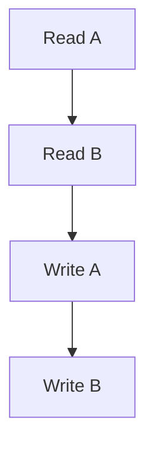
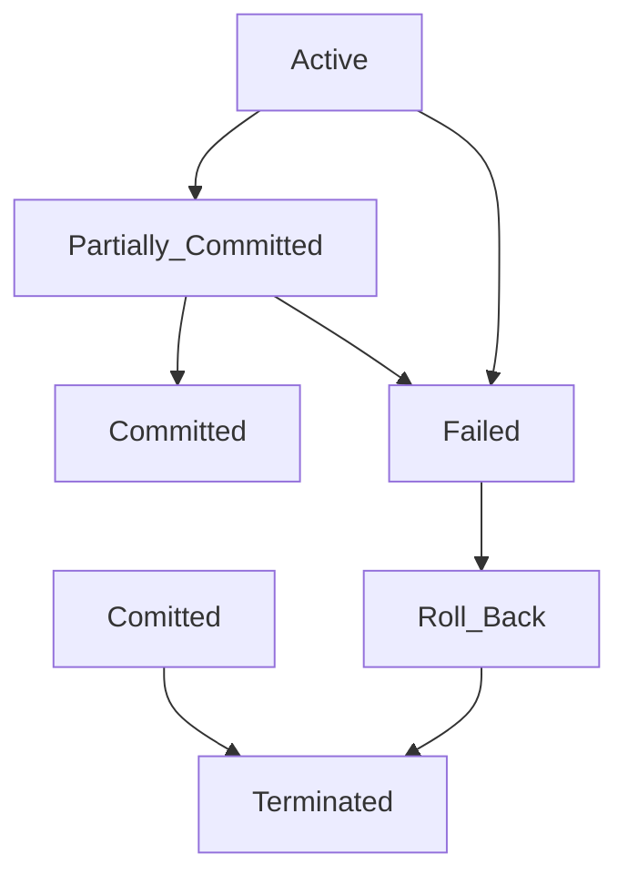

# ACID
## Atomicity
- The entire transaction takes place at once or doesn't happen at all
- Either all or none philosophy
- If there are a lot of operations in a transaction, and any one of them fails before the commit, we roll back to the previous state
- A failed transaction should not be resumed, it needs to be rolled back and restarted

- If during any operation during the transaction fails, no money will be credited or debited, it should roll back to the previous state before the transaction began
## Consistency
- The DB must be consistent before and after the transaction
- Ex: Before the transaction starts, and after it's completed, the sum of the sum of the total money should remain the same
## Isolation
- Multiple transactions occur independently without interference
- We serialize a parallel schedule into a parallel schedule to ensure consistency
- This ensures that multiple transactions can occur concurrently without leading to the inconsistency of the db state
- Transactions occur independently without interference
- Changes occurring in a particular transaction will not be visible of another until it has been committed
- Ex: A is giving money to B, simultaneously, C is giving money to A
## Durability
- The changes of a successful transaction occurs even if a system failure occurs
- Any changes made should remain permanent without changing
- This property ensures that once the transaction is completed, the updates and modifications to the database are stored in and written to disk, and they persist even if a system failure occurs

| Property    | Responsibility           |
| ----------- | ------------------------ |
| Atomicity   | Transaction Manager      |
| Consistency | Application Manager      |
| Isolation   | Concurrency Ctrl Manager |
| Durability  | Recovery Manager         |
A - T
C - A
I - C
D - R
# Relational Algebra Operators
$$
\begin{aligned}
&\text{Basic} \\
&\text{Selection} (\sigma) \\ 
&\text{Projection} (\pi) \\ 
&\text{Union} (U) \\ 
&\text{Set Difference} (-) \\ 
&\text{Set Intersection} (\cap) \\ 
&\text{Rename} (\rho) \\ 
&\text{Cartesian Product} (\times)
\end{aligned}
$$

CPU SSS
Cross Prod
Projection
Union
Set Difference
Set intersection
Selection

$$
\begin{aligned}
&\text{Derrived} \\
&\text{Natural Join} (⋈) \\
&\text{Conditional Join} \\
\end{aligned}
$$

$$
Touple Calculus: {t| P(t)}
$$
## TRC v/s DRC
```SQL
//Touple:
{S | S ∈ Students ∧ S.GPA > 3.5}

//Domain:
{<sID, sName, sGPA> | (∃sID, sName, sGPA) ∈ Students ∧ sGPA > 3.5}
```


# States Of Transaction




