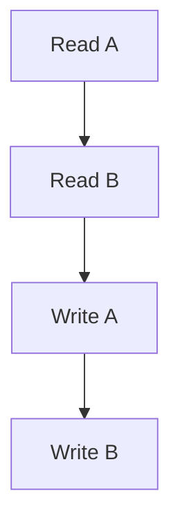

# ACID
## Atomicity
- The entire transaction takes place at once or doesn't happen at all
- Either all or none philosophy
- If there are a lot of operations in a transaction, and any one of them fails before the commit, we roll back to the previous state
- A failed transaction should not be resumed, it needs to be rolled back and restarted

- If during any operation during the transaction fails, no no

## Consistency
- The DB must be consistent before and after the transaction
- Ex: Before the transaction starts, and after it's completed, the sum of the sum of the total money should remain the same
## Isolation
Multiple transactions occur independently without interference
## Durability
The changes of a successful transaction occurs even if a system failure occurs