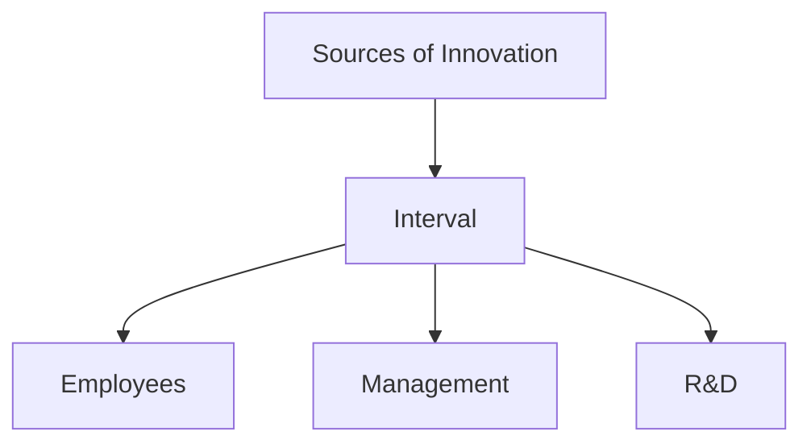
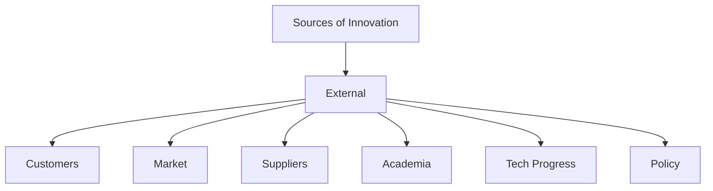
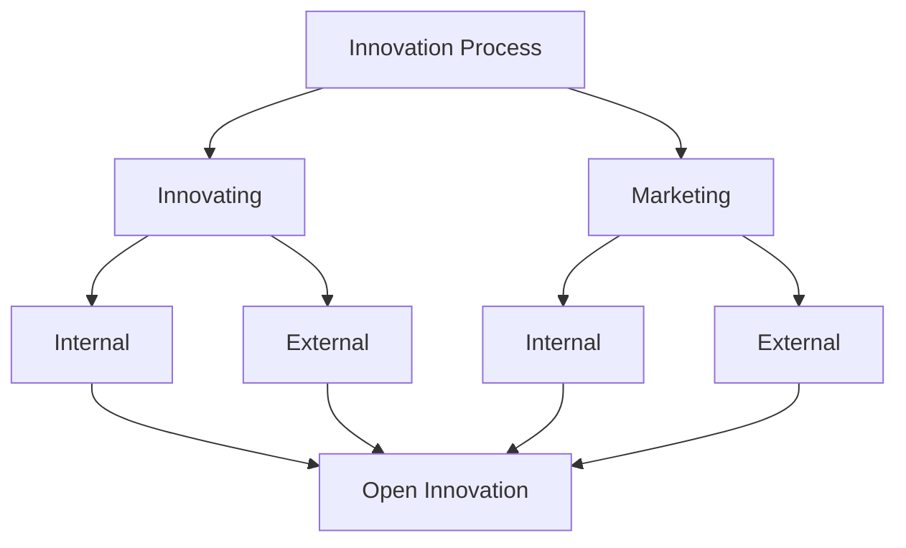

# What and Why
Innovation is the process of creating, developing or implementing new ideas into products, services or processes that improve efficiency, effectiveness, usability to gain a competitive edge.
It is not about inventing something entirely new, but also about making significant improvements to existing products, services, or processes.
# Types of Innovation

|                | Old Tech      | New Tech   |
| -------------- | ------------- | ---------- |
| **Old Market** | Incremental   | Disrputive |
| **New Market** | Architectural | Radical    |
- **Incremental:** Website
- **Disruptive:** iPhone
- **Architectural:** Electronic Fuel Injection, KFC - zinger
- **Radical:** Airplane
# Innovation as a Core Business process // Building an Innovative organization

COLR - Collar - White Collar + Blue Collar
## Resource Allocation
Investing in research and development (R&D) and providing the necessary resources for innovation
## Leadership Commitment
Senior Management must prioritize and supper innovation
## Organizational Culture
Fostering a culture that encourages creativity, risk taking, and continuous improvement

## Collaboration and Partnership
Engaging with external partners, including customers, and academia to foster innovation

# Sources

## Interval
- Employees
- Management
- R&D
## External
- Customers
- Market and Industry Trends
- Suppliers and Partners
- Academia
- Technological Progress
- Regulatory and Government Policy

# Knowledge Push v/s Need Pull

## Knowledge Push
It refers to the process where new innovation are driven by scientific knowledge or technology.
These innovations are often the result of R&D and may not initially have a specific market demand or need

### Characteristics
- Research Driven
- Proactive
- High Risk
- Tech-centric

### Examples
- Internet
- GORE-TEX
- CRISPR-Cas9

## Need Pull
It is the innovation driven by market demands or specific customer needs. These innovations arise when there is a clear problem or gap in the market that requires a solution

## Characteristics
- Market Driven
- Reactive
- Lower Risk
- Customer-Centric

### Examples
- Dyson Vacuum Cleaner
- Uber
- Spotify

## Combination : Case Study - Apple

# Open Innovation

