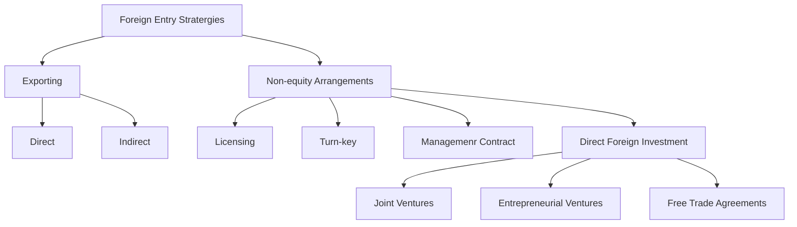

# Entry Strategies

## Export
An entrepreneur can start doing international business using exporting. It involves the sale & shipping of products manufactured in one country to customers in another country.
### Direct Exporting
It involves the use of independent distributors or the company's own overseas sales office in conducting international business. 
## Indirect Exporting
It involves a foreign purchase in the local market or using an export management firm. For certain commodities, foreign buyers actively seek our sources of supply and have purchasing offices in markets throughout the world.
## Non-Equity Arrangements
It is a method by which an entrepreneur can enter a market and obtain profit without any direct investment
### Licensing
It involves giving a foreign manufacturer the right to use a patent, technology, production process, or product in return for a royalty payment. 
### Turn-key Projects
It is a method of doing international business whereby a foreign entrepreneur supplies the manufacturing technology or infrastructure for a business and turns it over to local owners.
### Management Contracts
It is a non-equity method of international business in which an entrepreneur contracts his or her management techniques and skills to a foreign company
### Direct Foreign Investment
It is a mode of ownership for entrepreneurship using direct foreign investment for doing business sin international markets.
#### Joint Ventures
It is a direct form of DFI used by entrepreneurs to enter a foreign market. It is the joining of two firms in order to form a 3rd company in which the equity is shared, occurs in two situations:
- When an entrepreneur wants to purchase local knowledge
- Rapid entry is needed
purchasing over 50% stake in a company for majority control or 100% to get full control.
Mergers:
- Horizontal Merger
- Vertical Merger
- Product Extension
- Market Extension
- Diversified Activity
#### Entrepreneurial Partnership
In order to enter an internaitonal market, the entrepreneur can partner with an entrepreneur from that county who can help in achieving market goals and share a similar vision. Barriers and varying attitude may 
#### Trade Blocs and Free Trade Areas

