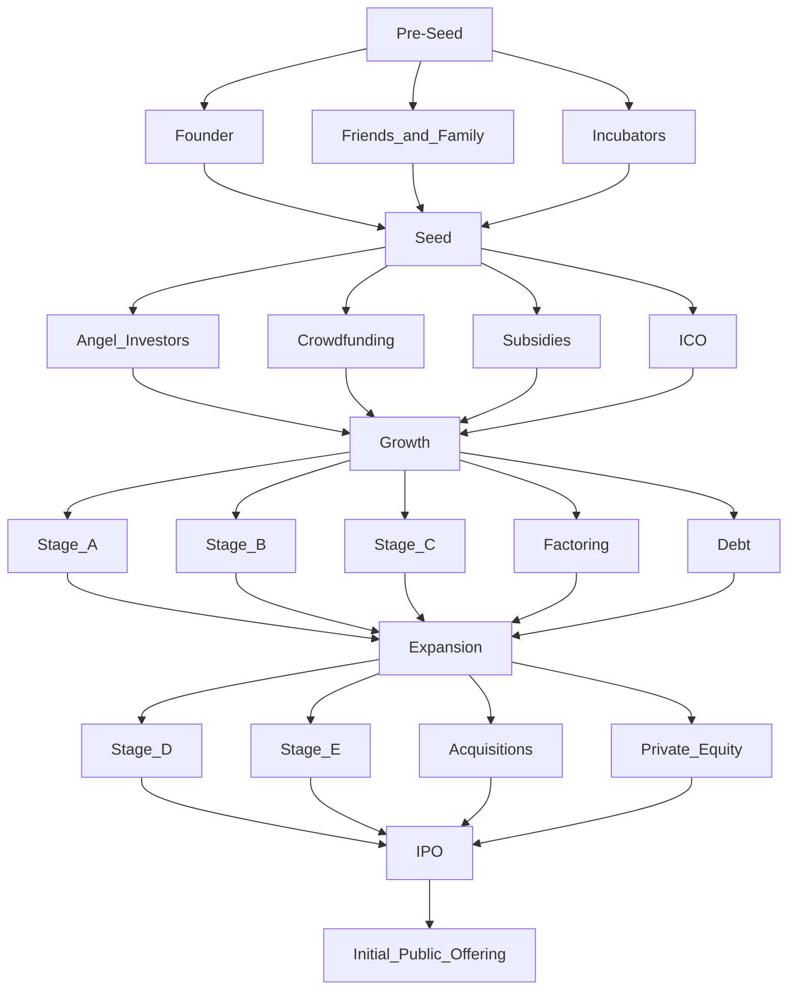

# Sources of Funding
- The Founders - Just been founded
- 3Fs - Pre-Seed
	- Friends
	- Family
	- Fools
- Angel - Seed
	- Not just money, but connections
- Crowdfunding
	- Loan
	- Convertible Loan
	- Pre-Order
- Subsidies
- Venture Capital - Private Equity
- Debt Financing - Banks
- Factoring
- Leasing
- Suppliers
- Cryptocurrency - Initial Coin Offering ICO
- IPO

# Stages of Start-Up
- Pre-Seed - Founder, Friends and Family, Incubators
- Seed - Angel Investors, Crowdfunding, Subsidies, ICO, 
- Growth - Stage A, Stage B, Stage C, Factoring, Debt
- Expansion - Stage D, Stage E, Acquisitions, Private Equity
- IPO

