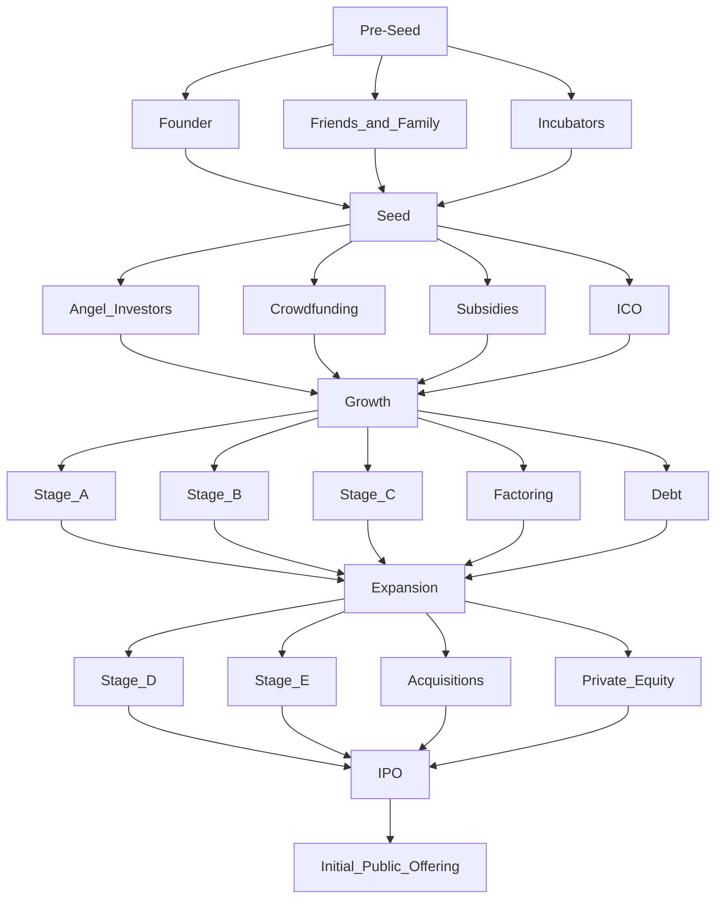

# Sources of Funding
- The Founders - Just been founded
- 3Fs - Pre-Seed
	- Friends
	- Family
	- Fools
- Angel - Seed
	- Not just money, but connections
- Crowdfunding
	- Loan
	- Convertible Loan
	- Pre-Order
- Subsidies
- Venture Capital - Private Equity
- Debt Financing - Banks
- Factoring
- Leasing
- Suppliers
- Cryptocurrency - Initial Coin Offering ICO
- IPO

# Stages of Start-Up
- Pre-Seed - Founder, Friends and Family, Incubators
- Seed - Angel Investors, Crowdfunding, Subsidies, ICO, 
- Growth - Stage A, Stage B, Stage C, Factoring, Debt
- Expansion - Stage D, Stage E, Acquisitions, Private Equity
- IPO

# Financial Valuation
It is the process of determining the economic value or a business or a company.
Valuation is important for various purposes, such as investment analysis, capital budgeting, merger and acquisition transactions.

## Market Cap
- Value = Share price * no of outstanding shares
- used for publically traded companies

## Discounted Cash Flow
- Projects future cash flows and discounts them back to present using discount rate
- $$Value = ∑(CFt/(1+r^t)​​)$$
- CFT: Cash Flow at t
- r: discount rate
- t: time period

## Comparable Company Analysis
- Compares the company to a similar company whose value is knows
- Metrics like EBITDA are used

## Asset Based
- Value = Assets - Liabilities
- used to calculate net asset value

## Book Value
- Accounts the balance sheet of the companies to find the values