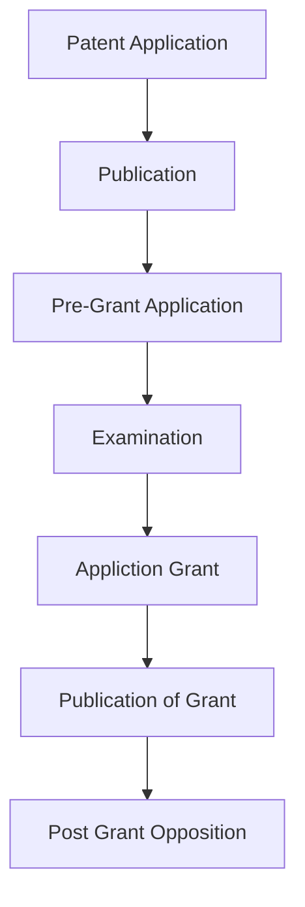
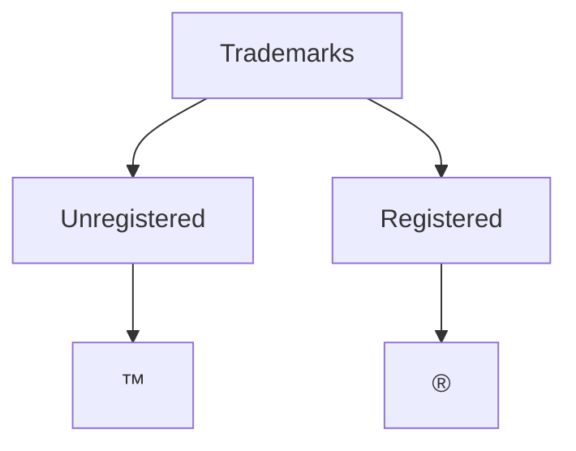

# Patent
A patent is a legally enforceable right guaranteed by a government authority to an inventor for a new, useful, and inventive device, substance, method or process.
A patent gives the inventor exclusive rights to commercially exploit the invention for monetary profits, for a limited time period, which under the Indian Constitution 
Requirements:
- New - Novel / 
- Useful - Have Utility
- Inventive - Non-obvious
- A suitable subject - Manner of Manufacture

## Application of Patent In India
- Idea conception
- Patent search
- Preparing Patent Application
	- Provisional Patent Application
	- Non-Provisional Patent Application
- Filing the Application
- Patent Examination
- Office Actions
- Patent Issuance
- Opposition and Renewal

Application Filling:
1. Complete specification submission after provisional specification - 12 months from the date of submission of provisional specification
2. National phase application
3. Convention application
4. Divisional application
5. Application for a patent of addition

Publication:
6. Publication of an application by IPO
7. Request for early publication
8. Publication of Patent

Examination:
9. Request for Examination
10. Request for expedited examination
11. Reason for expedited examination 

Hearing:
12. Written submission pursuant to a hearing of patent application

## Licensing
- **Exclusive License:** The licensee has the sole right to use the patent
- **Non-Exclusive License:** Multiple Licensees can use the patent
- **Cross-Licensing:** Two parties grant each other the rights to their respective patents

## Assignment
- Transfer of ownership totally to another owner
- Must be in writing and recording with the relevant patent office to be legally binding

## Infringement
Unauthorized making, using, selling or importing of a patented invention is called infringement
These include direct infringement, indirect infringement (inducing others to infringe), and contributory infringement (supplying components of a patented invention).

Patent owner is responsible for monitoring infringement
It can be addressed through negotiation, licensing or litigation.
For Litigating a patent, the owner files a lawsuit in court, the outcome of the suit could be to
- stop the inventory
- monetary damages
- award of attorney fee
- Compensatory Damages
- Treble Damages
- Injunction

# Trademark
A trademark is a recognizable sign, phrase symbol, or design that legally identifies a product or service and distinguished it from others.
It serves to identify the source of goods or services and create goodwill for the owner they can be indicative of quality and origin of a product or service.

## Registered v/s Unregistered
In Indian trademark law, the first user of an unregistered trademark has priority over a later user who registers the trademark if it can be proven that first use predated trademark registration. Registering a trademark gives the owner the exclusive right to use it, unless another entity's prior use can be established. Owners of unregistered trademarks can not sue for trademark infringement if another party uses their trademark, although they can seek a passing off remedy. In order to do so, the unregistered trademark owner must prove that damage was done to them by another trader taking advantage of the consumer goodwill attached to the trademark.
## Use in Marketing
- Brand Identity
	- Logo
	- Slogan
	- Name
- Product Packaging
	- Labels
	- Design
- Advertising and Promotions
	- Media
	- Social Media
	- Sponsorships
- Website and Online Presence
	- Domain Names
	- SEO
- Merchandising
	- Branded Merchandise
	- Co-branding
- Customer Service and Experience
	- Uniforms
	- Store Design

# Copyright ©️
it is a legal right that grants authors or creators of the art control over the use, distribution and monetization of their artwork.
In 1957, the first copyright law was passed, which has had a lot of amendments, most notably in 2012, to address changes in international treaties.

## Subjects covered in IPC Copyright Law
- Literary Words
- Dramatic Works
- Musical Works
- Artistic Works
- Cinematographic Works
- Sound Recordings

## Duration of Copyright
- Literary, Dramatic, Musical, Artistic: Death of Creator + 60 Years
- Cinematographic Films and Recordings, Anonymous Works: 60 years from beginning of the calendar year following year of production

## Rights Covered by IPC Copyright Law
- Reproduction of work
- Distribution of work
- Perform the work 
- Make translations or adaptations
- Broadcast the work
- Display the work publically

## Fair Use Doctrine
- Private Use
- Critisicm or Review
- Education
- Libraries
- Parody and Sattire

