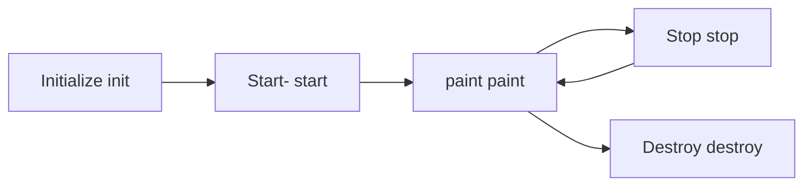

# Event Handling
## What is event
It is an action or occurrence recognized by software, typically originating from the user's interaction with the system. They change the state in the system.

Two types of events:
- User Generated
	- Mouse
	- Keyboard
	- Action
- System Generated
	- Window
	- Focus
	- Component

## Event Handling
- **Event Source:** the object that generated the event (like a button getting clicked)
- **Event object:** An instance of `ActionEvent` Is created when the button is clicked, containing information about the click event
- **Event Listener:** The class `SimpleEventListener` implements `ActionListner` and therefore acts as the listener
- **Event Handling Method:** The `actionPerformed` method is invoked when the button is clicked, and performs the required operation.


### Voting Eligibility AWT

```Java
import java.awt.*;
import java.awt.event.*;

public class VotingEligibility extends Frame implements ActionListener {
    private Label label;
    private TextField textField;
    private Button submitButton;

    public VotingEligibility() {
        label = new Label("Enter your age: ");
        textField = new TextField(3);
        submitButton = new Button("Submit");

        setLayout(new FlowLayout());
        add(label);
        add(textField);
        add(submitButton);

        submitButton.addActionListener(this);

        setTitle("Voting Eligibility Checker");
        setSize(300, 300);
        setVisible(true);

        addWindowListener(new WindowAdapter() {
            public void windowClosing(WindowEvent we) {
                System.exit(0);
            }
        });
    }

    public void actionPerformed(ActionEvent ae) {
        try {
            int age = Integer.parseInt(textField.getText());
            if (age > 18) {
                showMessage("OK");
            } else {
                showMessage("Not OK");
            }
        } catch (NumberFormatException e) {
            showMessage("Invalid input");
        }
    }

    private void showMessage(String message) {
        Dialog dialog = new Dialog(this, "Message", true);
        dialog.setLayout(new FlowLayout());
        dialog.add(new Label(message));
        Button ok = new Button("OK");
        ok.addActionListener(new ActionListener() {
            public void actionPerformed(ActionEvent e) {
                dialog.setVisible(false);
                dialog.dispose();
            }
        });
        dialog.add(ok);
        dialog.setSize(200, 100);
        dialog.setVisible(true);
    }

    public static void main(String[] args) {
        VotingEligibility app = new VotingEligibility();
    }
}

```

# Applet
It is a type of java program that is designed to be embedded within a web page and run in a web browser. It's a java application which extends the java.applet.Applet class or implements the javax.swing.JApplet class.
Applets often create GUIs using components such as TextFields, buttons, and images to make it more intractable for the end user.
They are event driven applications such as mouse clicks, keyboard inputs and network requests.

## Life Cycle of Applet
It is the sequence of events that occur from the initialization to the termination of an applet.

1. Initialization - init()
	- Is called when the applet is first loaded into memory
	- it initializes the appler, sets up parameters, and performs any necessary setup tasks
	- called only once in the life of an applet
2. Start - start()
	- Is called after init()
	- used to start the execution fo the applet code
	- can be called multiple times, as an applet can be started and stopped
3. Running - paint() & repaint
	- Once it is running, we can use the paint() function multiple times to load and display the gui elements of the applet
4. Stop - stop()
	- when the stop() method is claled, it is no logner visible on the screen
	- this happens when teh user navigates away from the applet or minimizes the window
	- we can also use this to suspend any ongoing activities or execution activities which should not continue when the applet is not visible
5. Destroy - destroy()
	- it is called when the applet needs to be unloaded from memory
	- it releases any resources and performs cleanup tasks, where it closes all files and db connections




