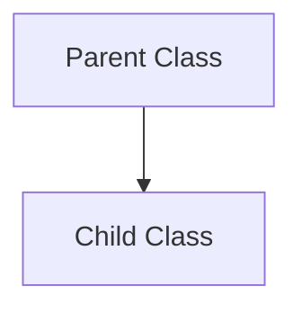
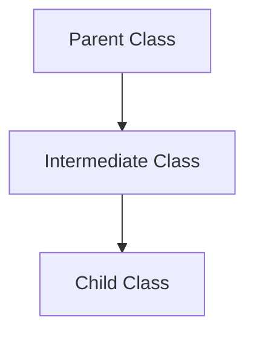
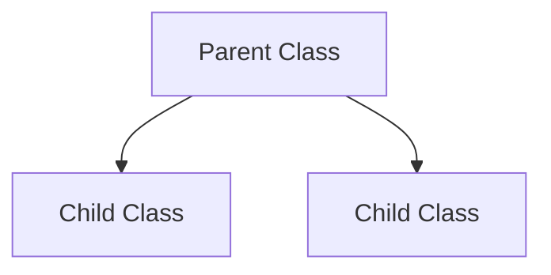
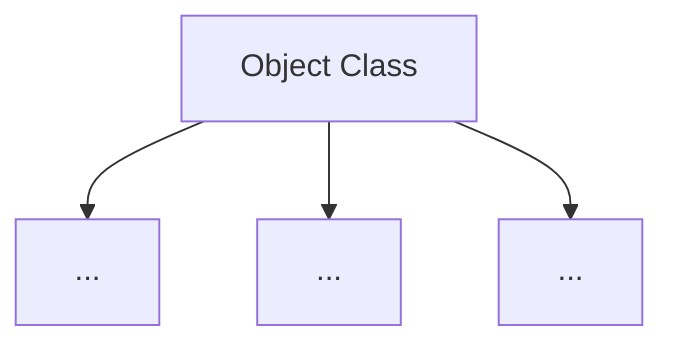

## Types of Inheritance in Java

Single


Multilevel


Hierarchical



## Member Access Rulers
They are also called Access Specifiers, they determine the visibility and accessibility of class members (Fields, Methods, Constructions, and Nested Classes) 

- Public
	members are accessible by any other class
	```Java
	public class MyClass {
	    public int publicField;
	    public void publicMethod() { }
	}
```

- Protected
	Members are accessible withing the same package and subclasses, even if they are in different places
```Java
	public class MyClass {
	    protected int protectedField;
	    protected void protectedMethod() { }
	}
```

- Default
	members are only accessible within the same package, this is called `package-private` access
	```Java
	public class MyClass {
	    int defaultField; // No access modifier
	    void defaultMethod() { } // No access modifier
	}
```

- Private
	Members are accessible only within the class where they are defined in

```Java
	public class MyClass {
	    private int privateField;
	    private void privateMethod() { }
	}
```


## Super Keyword
The super keyword in Java is a reference variable which is used to refer immediate parent class object.
Whenever you create the instance of subclass, an instance of parent class is created implicitly which is referred by super reference variable.

Use of Super keyword:
- Super can be used to refer immediate parent class instance variable
- super can be used to invoke immediate parent class method
- super can be used to invoke immediate parent class constructor

``` Java
class Animal {
    String color = "Orange";
}

class Dog extends Animal {
    String color = "Brown";

    void printColor() {
        System.out.println(color);
        System.out.println(super.color);
    }
}

class SuperLantidi {
    public static void main(String args[]) {
        Dog d = new Dog();
        d.printColor();
    }
}
```


## Final Class
It is a class that is declared with the final keyword. A final class cannot be inherited by any other class, it cannot be extended. A final class bust be complete, and cannot be abstract. All wrapper classes are final, such as String Integer etc. If we try to inherit a final class, the compiler will throw an error.

```Java
final class className 
{
    // Body of class
}
```


## Object class
The object class is the parent of all the classes in Java by default. In other words, it is the topmost class of Java.
The object class is beneficial if you want to refer to any object whole type you don't know. The parent class reference variable can refer the child class object, known as upcasting.



Methods:
- public final class getClass()
- public int hashCode()
- public boolean equals()
- public String toString()
- publi final void notify()