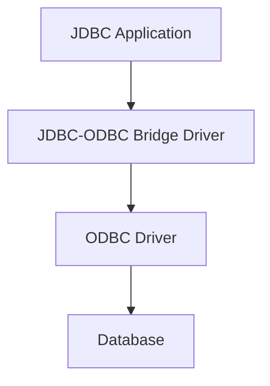
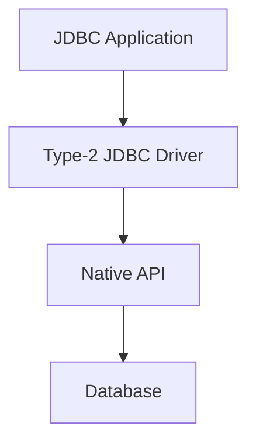
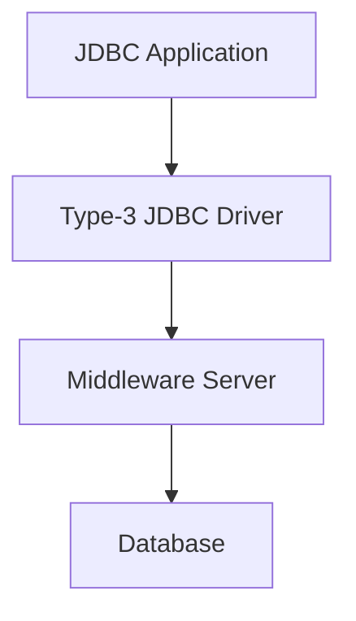
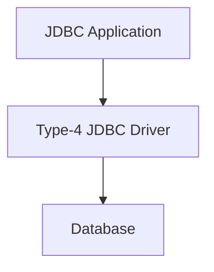

# Java Streams
In Java, streams are used to perform I/O Operations. They are primarily categorized into two types: Byte Streams and Character Streams

## Byte Streams
They handle I/O of raw binary data. They read and write data in bytes. Byte streams are typically used for data that is not text, like images or executable files.

### Key Classes:
- FileInputStream
- FileOutputStream
### Example
```Java
import java.io.FileInputStream;
import java.io.FileOutputStream;
import java.io.IOException;

public class ByteStreamExample {
    public static void main(String[] args) {
        FileInputStream fis = null;
        FileOutputStream fos = null;

        try {
            fis = new FileInputStream("inputFile.txt");
            fos = new FileOutputStream("outputFile.txt");
            int byteContent;
            while ((byteContent = fis.read()) != -1) {
                fos.write(byteContent);
            }
            System.out.println("File copied successfully using Byte Streams.");
        } catch (IOException e) {
            e.printStackTrace();
        } finally {
            try {
                if (fis != null) {
                    fis.close();
                }
                if (fos != null) {
                    fos.close();
                }
            } catch (IOException ex) {
                ex.printStackTrace();
            }
        }
    }
}
```

## Character Streams
They handle I/O of character data (text). They read and write in 16-bit Unicode. They are used for text files.

### Key Classes
- FileReader
- FileWriter

### Example
```Java
import java.io.FileReader;
import java.io.FileWriter;
import java.io.IOException;

public class CharStreamExample {
    public static void main(String[] args) {
        FileReader fr = null;
        FileWriter fw = null;

        try {
            fr = new FileReader("inputFile.txt");
            fw = new FileWriter("outputFile.txt");

            int charContent;
            while ((charContent = fr.read()) != -1) {
                fw.write(charContent);
            }
            System.out.println("File copied successfully using Character Streams.");
        } catch (IOException e) {
            e.printStackTrace();
        } finally {
            try {
                if (fr != null) {
                    fr.close();
                }
                if (fw != null) {
                    fw.close();
                }
            } catch (IOException ex) {
                ex.printStackTrace();
            }
        }
    }
}
```

# JDBC
It stands for Java DB Connectivity. It is a Java API to connect and execute queries with a Database. It is a specification from Sun that provides a standard abstraction for Java applications to communicate with various databases. Furthermore, it provides the language with connectivity standards. Moreover, it is used to write programs required to access databases.

JDBC is an API used in Java programming to interact with databases. The classes and interfaces of JDBC allow the application to send requests made by users to the specified database.


## Drivers
### Type 1: JDBC ODBC bridge driver
ODBC → Open DB Connectivity
This driver acts as a bridge between JDBC and ODBC drivers. It translates JDBC calls into ODBC calls, which are then handled by the ODBC drivers.



### Type 2: Native API driver
This driver converts JDBC calls into database-specific native API calls provided by the database vendor. This is partially written in Java and partly in native code.


### Type 3: Network Protocol driver
This driver translates JDBC calls into a database-independent network protocol, which is then converted into database-specific calls by a middleware server.


### Type 4: Thin driver
This driver translated JDBC calls directly into database-specific calls without any translation. It is a fully Java based driver and communicates with the DB using the DB's network protocol.

