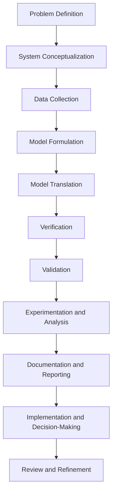

## Queuing Theory - M/M/1

$$
\begin{aligned}
Ls=λ / (μ−λ​) \\
Lq=λ^2 / μ(μ−λ​) \\
\\
Ws=1 / (μ−λ​) \\
Wq=λ / μ(μ−λ​) \\ 
\end{aligned}
$$

L -> No of customers
W -> Average time spent by the customer
q -> In the queue
s -> In the whole system

## Queuing Disciplines - SERPLF
They are the different disciplines which determine the order by which the customers waiting in a queue are served. Different disciplines are used for different tasks based on the needs of the system

- FCFS - coffee
- LCFS - warehouse
- SJN - grocery shop
- Random - crowd
- Priority - theme park
- Earlieist Deadline First - hospital

## Customer Behavior

- Balking:
	Balking occurs when potential customers decide not to enter the queue upon seeing its length and anticipated waiting time
	Can be mitigated by:
	- Prividing clear info about wait times
	- using digital displays to indicate queue length or waiting time
	- encahncing percieved value to make the wait time worth the reward
	- creating a comfortable queuing environment
- Regening:
	Happens when a customer initially joins the queue but leave before reviieving the service due to impatience or frustration regarding wait times
	Can be mitigated by
	- Regular updates to customers on wait time
	- ensuring a comfortable and stress free queuing environment
	- implementing virtual queing systems
- Jockeying:
	Jockeying occurs when customers switch between queues in an effort to reduce wait times
	Mitigation:
		single-line multi-server queues
		visibility is limited to prevent comparision
		comminicate clearly and early about the queung system

## Kendal's Notation
It's a standardized way to describe queuing models, tis a systematic method to specify the chars of any queuing system, it follows the format:
A B s K N D
- A - Arrival Process
	- Describes the distribution of inter-arrval times
		- M - Markovian / Memory less - exponential inter-arrival time - poission
		- D - Deterministic inter-arrival time  - constant
		- G - General inter-arrival time - arbitrary
- B - Service process
	- Describes the distribution of service processes
		- M - Exponential service times
		- D - Determinsitic service time
		- G - General service time
- s - No of Servers
	- 1 for 1 server, 8 for 8
- K - System Capacity
	- Maximum number of customers allowed in the system (both in queue and service)
	- If not specified, is assumed to be infinite
- N - Population size
	- The size of the calling population
	- again assumed to be infinite if not specified
- D - Queuing discipline 
	- SJF
	- Earliest deadline
	- Random
	- Priority
	- LCLS
	- FCFS

Example: 
M/M/1 - exponential/exponential/1/infinite/

## Simulation
In the context of Operations Research, Simulation refers to the use of computational models to imitate the operation of real-world processes or systems over time. It allows analysts to study the behavior and performance of these systems without having to conduct real world experiments, which are expensive both in terms of time, money and resources. 

Key aspects of simulation:
- Modelling
	Creating a mathematical or logical representation of a real-world system. This model includes variables, relationships, and rules that govern the system's behavior.
- Types of Simulations:
	- Discrete Event Simulation DES: Focuses on events that occur at distinct points in time, it's used for systems where changes happen at specific moments
	- Continuous Simulation: Deals with systems that change continuously over time, this is used for processes that are smooth, concurrent and ongoing.
	- Monte Carlo Simulation: uses random sampling and statistical modelling to estimate the mathematical functions and simulate the behavior of complex systems.
- Experimentation
	Running Simulations to conduct experiments, analysts can manipulate the weights and variables to observe outcomes to understand how the change will impact the system.
- Analysis
	Evaluating simulatin results to gain insights and make informed decisions. This may include statistical analysis, viz, and comparision of scenatios.
- APplications
	SImulation is used in various fields such as manufacturing, logistics, healthcare, finance and more. It helps optimize processes, improve efficiency, and supports planning.

## Steps of Simulation

- Problem Definition:
	- Clearly define the problem or system to be studied
	- Identify the objectives of the simulation study, including what questions need to be answered and what decisions need to be supported
- System Conceptualization:
	- Develop a conceptual model of the system, this involves identifying the key components, processes, and interactions with the system.
	- Decide on the level of detail and granularity that you wish to achieve while ensuring its manageable computationally
- Data Collection:
	- Gather data needed to build and validate the model, this includes time series data, expert opinions and other relevant information
	- Ensure data relevance and accuracy.
- Model Formulation:
	- Translate the conceptual model into a formal simulation model, this involves defining parameters, variables, relationships and rules of the system.
- Model Translation:
	- Implement the simulation model using the appropriate software tools, this involves coding the model and ensuring it accurately reppresents the conceptual design.
	- Tools like Arena, AnyLogic, Simul8 are used.
- Verification:
	- Check the model for errors and ensure it behaves as intended.
	- This involves debugging the model, running preleminary tests, and making corrections as needed
- Validation:
	- Compare the model output with real-world data to ensure it accurately represents the system
	- this may involve statistical tests sensitivity analysis, and consulatiosn with experts to ensure the validity
- Experimentation and Analysis:
	- Design and conduct experiments using the simulation model by running it under various scenarios and conditions to observe outcomes.
	- Analyze the results to gain insights into the system's behavior and performance. Use statistical methods and viz tools to interpret the data.
- Documentation and Reporting:
	- Document the model study and findings, including the probelm defenition, model formulation, data sources, verificationa dn validation procedures and findings
	- prepare reports and presentations to communicate the results with the stakeholders
- Implementation and Decision making
	- Use the insights gained from the simulation to make more informed desicions about changes in the real world systems
- Review and Refinement
	- COntinuously review the simulation model and its assumptions to make usre it remains relevant and accurate and updat the model as new data and insights become available.

## RNG
Random Number Generation is crucial in simulations, especially in Monte Carlo and discrete cenet simulations, to introduce variability amd mimic real-world randomness. Psuedo-random number gens like Mersenne Twister create sequences of number that appear and function like true random numbers but are generated from a seed for reproducilibity. Uniform random numbers generated by PRNGs are transformed into random variated following scientific probability distrbutions using methods such as inverse transform, acceptance rejection, and box muller transform.

In discrete event simulations, random numbers model interarrival times, service times, and routing desicions. In monte carlo simulations, there are used to sample from the distributions an estimate event probabilities through repeated trials. RNG enables simulations to accurately reflect uncertainity and stochastic behavior, aiding in the analysis and desicion making for complex systems in OR.