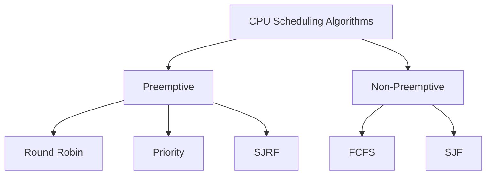

## Process Scheduling

In a multiprogramming Operating System, it is a very important task of the OS to control which process is being executed at a particular time. This involves managing the processes and memory associated with the processes.

#### Objectives of Scheduling:
- Maximize Throughput
- Minimize response time
- Balance resource use
- Avoid infinite postponement
- Enforce priorities

#### Scheduling Queues
- Job Queue
- Ready Queue
- Device Queue

#### Types of Schedulers
- Long Term Schedulers - job scheduler
- Medium Term Schedulers - process swapping
- Short Term Schedulers - CPU scheduler

#### Scheduling Criteria
- **Throughput:** How many jobs are completed by the CPU in a time period
- **TA Time:** The time interval between the submission of a process and the time of completion
- **Waiting Time:** Time spent by the process to wait for the CPU to be allocated
- **Response Time:** Time duration between submission and first response
- **CPU Util:** percent of CPU being used and not idle

