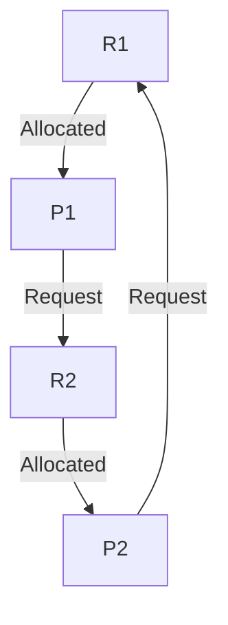

# Deadlock
If two or more processes are waiting for an event which will never take place due to an unbounded wait, those processes are said to be in deadlock

## Conditions for deadlock:
- Mutual Exclusion
- No Preemption
- Hold and Wait
- Circular Wait