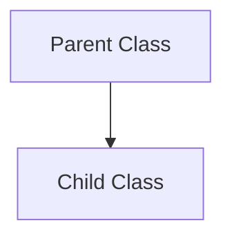
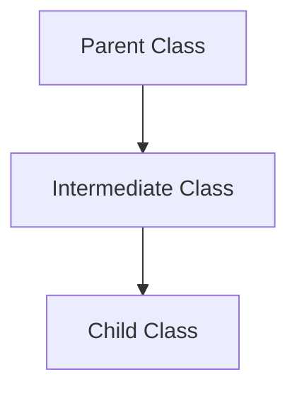
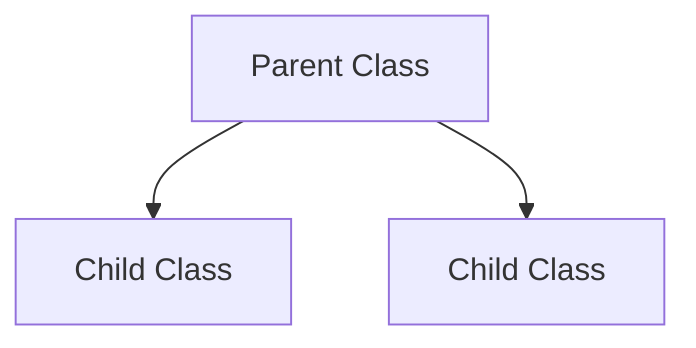

## Types of Inheritance in Java

Single


Multilevel


Hierarchical



## Member Access Rulers
They are also called Access Specifiers, they determine the visibility and accessibility of class members (Fields, Methods, Constructions, and Nested Classes) 

- Public 
	members are accessible by any other class
	```Java
	public class MyClass {
	    public int publicField;
	    public void publicMethod() { }
	}
```
- Protected
	Members are accessible withing the same package and subclasses, even if they are in different places
```Java
	public class MyClass {
	    protected int protectedField;
	    protected void protectedMethod() { }
	}
```
- Default
	members are only accessible within the same package, this is called `package-private` access
- Private
	Members are accessible only within the class where they are defined in