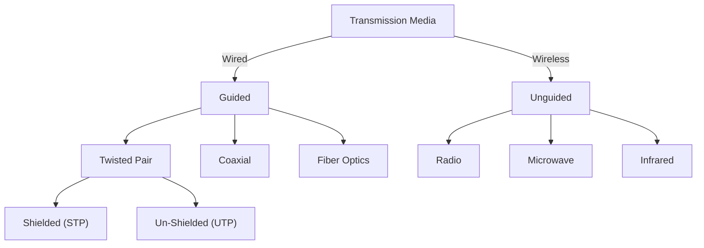

# OSI Model
- OSI → Open System Interconnect
- Proposed by ISO as a step to standardize protocols
APSTNDP
1. Application - Services - DNS, HTTPS, SMTP
2. Presentation - Data Encoding / Compression
3. Session - Fixed time period - Establishing + Terminating Connections
4. Transport - Internet Protocol - TCP + UDP, Firewall
5. Network - Routing + Frames → Packets - Router L3 Switches
6. Data Link - MAC Add + Bits → Frames + Checksums (CRC) - Switch, Bridge
7. Physical - Medium of Transfer - Cables, Wi-Fi, Hub, Modem, Repeater

# Topologies
BSRMTH
1. Bus
	- All components are connected by one cable
	- No Security + Collisions
	- Less Expensive + Easy to Install
2. Star
	- All the devices are connected to one device
	- Less Expensive + Secure
	- Single point of failure
3. Ring
	- Devices are connected with adjacent Devices in an undirected flow of data
	- No Collisions
	- Expensive + Difficult to reconfigure
4. Mesh
	- Every system is connected to every system
	- if n systems are there, $\frac{n(n-1)}{2}$ systems are required
	- Expensive + Difficult to re-configure
5. Tree
	- Combination of bus + star
6. Hybrid
	- Combination of multiple topologies

# CRC
Cyclic redundancy check is an error detection code commonly used to detect accidental changes to raw data in digital networks and storage devices. It works by treating the binary data and dividing it with a fixed `generator` number, and appending the remainder called the `CRC Code` to the data.

# Hamming Code
It is an error correction algorithm used to ensure data accuracy during transmission or storage. 
It detects and corrects the errors that can occur when data is moved or stored from sender to receiver
It's a simple and effective method which improves the reliability of communication

# Transmission Medium

