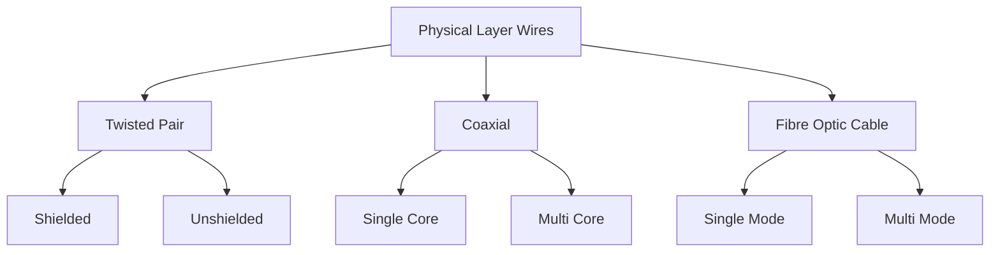

# Unit I

## OSI
Open System Interconnection model is a conceptual framework used to understand and implement network communication between devices. It divides communication into seven layers, each with specific responsibilities. The layers ensure standardization and interoperability between different systems.

### 1. Physical Layers
- Deals with physical connection between devices and transmission of raw binary data
	- Defines Cables, Connectors and data rates
	- transmits bits as optical, electrical, or radio signals
		- e.g.: Ethernet, Fiber Optics, USB
### 2. Data Link
- Ensures error-free data transfer between devices on the same network
	- Handles MAC Addressing
	- Data Frames
	- Detects and corrects errors from physical layer
		- Logic Link Control - LLC
		- Media Access Control - MAC
			- Switches, MAC addresses, ARP
### 3. Network
- Manages data routing, forwarding and addressing between networks
	- IP Addressing
	- Packet Routing
		- Routers, IP Addresses - v4 and v6
### 4. Transport layer
- Ensures reliable data transfer between systems, including error recovery and flow control
	- Segmentation and reassembly
	- Port addressing
		- Transfer Control Protocol
		- User Data gram Protocol
### 5. Session layer
- Manages sessions (connections) between applications
	- Session establishment
	- Synchronization and recovery of sessions
		- APIs, SSH
### 6. Presentation layer
- Translates data into a format that the application layer can understand
	- Data Encryption and Decryption
	- Data compression and formatting
		- JPEG, PNG, SSL/TLS
### 7. Application layer
- Interfaces with end-user applications and provides network services
- Network resource sharing
- Application services like email or file transfer
	- HTTP/S, FTP, SMTP, DNS

| Layer                | Hardware                  | Software          |
| -------------------- | ------------------------- | ----------------- |
| **1 - Physical**     | Wires, Models, Hubs, WAPS | Firmware          |
| **2 - Data Link**    | Switches, Bridges, NIC    | MAC, ARP          |
| **3 - Network**      | Routers, L3 Switches      | IP, ICMP          |
| **4 - Transport**    |                           | TCP, UDP          |
| **5 - Session**      |                           | SSH, APIs         |
| **6 - Presentation** |                           | SSL, TLS, JPEG    |
| **7 - Application**  |                           | HTTP/S, SMTP, FTP |
## Topologies
![[Network+Topologies-1344625362.png]]
Star - Small Home or Office Networks
Bus - Printers, Old Networks, Small LAN
Ring - Fiber Distributed Data Interface, Industrial Networks
Mesh - Military, IoT
Tree - Large corporate networks, University networks (Departments)
Hybrid - Enterprise, Data Centers

## Transmission Media

# Unit V

## DNS
