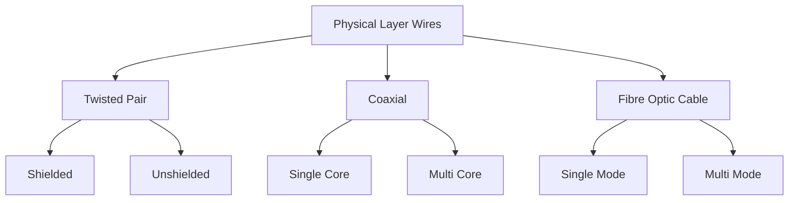
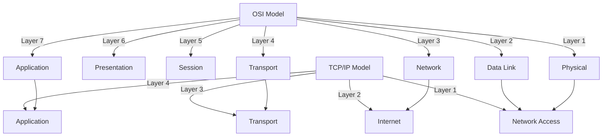
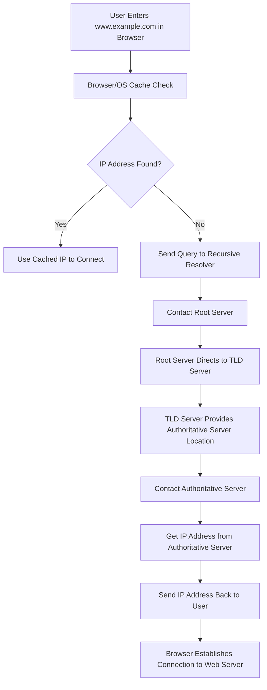

# Unit I

## OSI
Open System Interconnection model is a conceptual framework used to understand and implement network communication between devices. It divides communication into seven layers, each with specific responsibilities. The layers ensure standardization and interoperability between different systems.

### 1. Physical Layers
- Deals with physical connection between devices and transmission of raw binary data
	- Defines Cables, Connectors and data rates
	- transmits bits as optical, electrical, or radio signals
		- e.g.: Ethernet, Fiber Optics, USB
### 2. Data Link
- Ensures error-free data transfer between devices on the same network
	- Handles MAC Addressing
	- Data Frames
	- Detects and corrects errors from physical layer
		- Logic Link Control - LLC
		- Media Access Control - MAC
			- Switches, MAC addresses, ARP
### 3. Network
- Manages data routing, forwarding and addressing between networks
	- IP Addressing
	- Packet Routing
		- Routers, IP Addresses - v4 and v6
### 4. Transport layer
- Ensures reliable data transfer between systems, including error recovery and flow control
	- Segmentation and reassembly
	- Port addressing
		- Transfer Control Protocol
		- User Data gram Protocol
### 5. Session layer
- Manages sessions (connections) between applications
	- Session establishment
	- Synchronization and recovery of sessions
		- APIs, SSH
### 6. Presentation layer
- Translates data into a format that the application layer can understand
	- Data Encryption and Decryption
	- Data compression and formatting
		- JPEG, PNG, SSL/TLS
### 7. Application layer
- Interfaces with end-user applications and provides network services
- Network resource sharing
- Application services like email or file transfer
	- HTTP/S, FTP, SMTP, DNS

| Layer                | Hardware                  | Software          |
| -------------------- | ------------------------- | ----------------- |
| **1 - Physical**     | Wires, Models, Hubs, WAPS | Firmware          |
| **2 - Data Link**    | Switches, Bridges, NIC    | MAC, ARP          |
| **3 - Network**      | Routers, L3 Switches      | IP, ICMP          |
| **4 - Transport**    |                           | TCP, UDP          |
| **5 - Session**      |                           | SSH, APIs         |
| **6 - Presentation** |                           | SSL, TLS, JPEG    |
| **7 - Application**  |                           | HTTP/S, SMTP, FTP |
## Topologies
![[Network+Topologies-1344625362.png]]
Star - Small Home or Office Networks
Bus - Printers, Old Networks, Small LAN
Ring - Fiber Distributed Data Interface, Industrial Networks
Mesh - Military, IoT
Tree - Large corporate networks, University networks (Departments)
Hybrid - Enterprise, Data Centers

## Transmission Media

## Computer Networks v/s Distributed Systems

# Unit IV

## OSI v/s TCP/IP

Differences:
- OSI has 7 layers to TCP/IP's 4
- OSI is mainly theoretical while TCP/IP is delayed worldwide
- OSI is protocol independent, while TCP/IP is well… Defined around… You guessed it... TCP and IP
- OSI gives wayyy too many fucks about Error handling while TCP/IP is just a chill guy

OSI is a theoretical best used for understanding the structure of computer networks, while TCP/IP is the backbone of modern communication, enabling the internet.

### TCP/IP
- only 4 layers compared to OSI's 7
1. Application - Application + Presentation + Session
2. Transport - Transport
3. Internet - Network
4. Network Access - Data Link + Physical
- Developed by the US DoD
- Is the basis of the internet

## UDP v/s TCP

| \                   | UDP                         | TCP                                |
| ------------------- | --------------------------- | ---------------------------------- |
| **Connection Type** | Connectionless              | Connection-oriented                |
| **Reliability**     | Unreliable, no ack          | Reliable, ack, retransmission      |
| **Speed**           | Faster, low overhead        | Slower due to connection mgmt      |
| **Use Cases**       | Real-time apps, DNS, gaming | Web browsing, email, file transfer |
| **Header Size**     | 8 bytes                     | 20-60 bytes                        |
## DNS
Domain Name System is a hierarchical naming system that translates human-readable domain names into IP addresses that computers use to identify each other on the network. It is like a phone book for the internet.

How It works:
1. **Check Browser Cache** - The browser first checks its cache to see if it already has the IP address
2. **OS Resolver Cache** - If not found in the browser cache, it queries the operating system's system resolver cache
3. **Recursive Resolver** - If the OS does not know, it forwards the query to a DNS recursive resolver, often provided by ISPs or a public DNS like Googles 8.8.8.8 or Cloud Flare's 1.1.1.1
4. **DNS Hierarchy** - The recursive resolver navigates through the DNS hierarchy:
	1. **Root Server**
		1. Top Level of the DNS Hierarchy
		2. Knows the locations of all the TLD Servers
		3. Querying Starts Here
	2. **TLD (Top Level Domain) Server**
		1. Manages specific TLDs like `.com` or `.org` or `.in`
		2. a `.com` query would be handled by its respective TLD server
	3. **Authoritative Name Server**
		1. Responsible for specific domain names
		2. Stores DNS records like `A`, `AAAA`, or `CNAME`
		3. Provides the final IP Address for the requested domain
DNS Record Types:
1. **A** - Maps a domain to an IPv4 address
2. **AAAA** - Maps a domain to an IPv6 address
3. **CNAME (Canonical Name)** - Maps one domain to another `www to example.com`
4. **MX** - Mail Server
5. **NS** - Name Server
6. **TXT** - Stores verification data
7. **PTR** - Maps IP Address to domain to perform reverse lookup

# Unit V
## Protocols

| Protocol      | Purpose                                | Port         |
| ------------- | -------------------------------------- | ------------ |
| **TELNET**    | Remote Login and Management            | TCP 23       |
| **SMTP**      | Sending Mails to recipient Mail Server | 25, 465      |
| **IMAP**      | Receiving Mails w/o deletion           | 143, 993     |
| **POP3**      | Receiving Mails w/ deletion            | 110, 995     |
| **HTTP**      | Web Page Transfer                      | TCP 80       |
| **HTTPS**     | Secure Web Page Transfer               | TCP 443      |
| **SNMP**      | Network Management                     | UDP 161, 162 |
| **FTP**       | File Transfer                          | TCP 20, 21   |
| **Bluetooth** | Short Range Wireless PAN               | -            |

| Protocol   | Port         |
| ---------- | ------------ |
| **TELNET** | TCP 23       |
| **SMTP**   | 25, 465      |
| **IMAP**   | 143, 993     |
| **POP3**   | 110, 995     |
| **HTTP**   | TCP 80       |
| **HTTPS**  | TCP 443      |
| **SNMP**   | UDP 161, 162 |
| **FTP**    | TCP 20, 21   |

