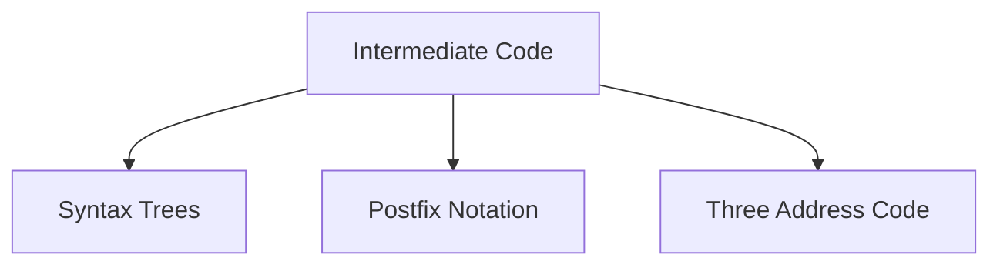
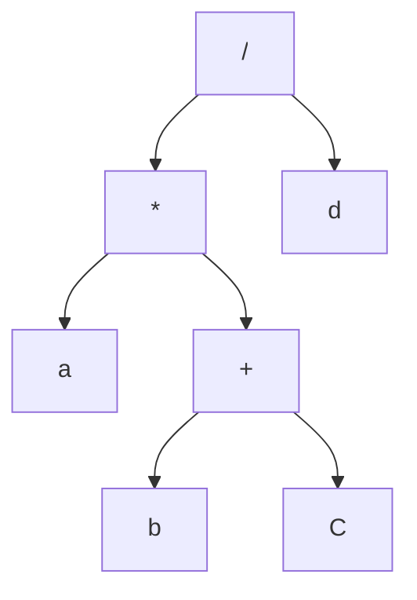
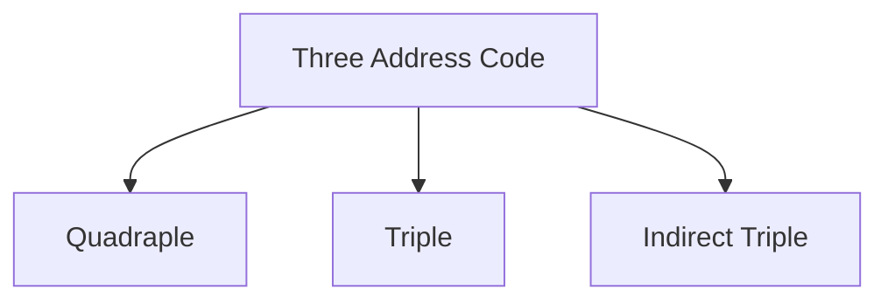

# Intermediate Code Notations


## Abstract Syntax Tree

Ex: a * (b + c) / d



- Brackets have the highest precedence so first we make that
- * and / have equal precedence so we go left to right
- **Thing to remember:** The nodes you make first will be lower down the tree

## Postfix
(a + b) * c → a b + c *
a + (b * c) → abc * +

## Three Address Codes
- Each Instruction can contain at most three addresses on the left-hand side and at most one instruction on the right-hand side



x + y * z
	t1 = y * z
	t2 = x + t1

a = b * - c + b * - c
	 t1 = - c
	 t2 = b * t1
	 t3 = - c
	 t4 = b * 3
	 t5 = t4 + t3

### Quadruple

| #   | op  | arg1 | arg2 | res |
| --- | --- | ---- | ---- | --- |
| 0   | -   | c    |      | t1  |
| 1   | *   | b    | t1   | t2  |
| 2   | -   | c    |      | t3  |
| 3   | *   | b    | t3   | t4  |
| 4   | +   | t2   | t4   | t5  |

### Triple

| #   | op  | arg1 | arg2 |
| --- | --- | ---- | ---- |
| 0   | -   | c    |      |
| 1   | *   | b    | 0    |
| 2   | -   | c    |      |
| 3   | *   | b    | 2    |
| 4   | +   | 3    | 1    |
### Indirect Triple
- Contains a pointer to memory addresses 

| #   | op  | arg1 | arg2 | pointer |
| --- | --- | ---- | ---- | ------- |
| 0   | -   | c    |      | 100     |
| 1   | *   | b    | 0    | 101     |
| 2   | -   | c    |      | 102     |
| 3   | *   | b    | 2    | 103     |
| 4   | +   | 3    | 1    | 104     |

### Forms of Assignment
- Binary Operations → y op z
- Unary Operations → op x
- Copy Operation → x = 10
- Unconditional Jump → goto L
- Conditional Operation → if x RelOp y (Relational Operator)
- Procedure Calls / Return → parameter x
- Address and Pointer Assignment → x = & y | x = * y
- Indexed Copy Instruction → DS\[index]

(a + b) * (c+d) - (a + b + c)
- t1 = a + b
- t2 = c + d
- t3 = t1 * t2
- t4 = t1 + c
- t5 = t3 - t4

|  #  | op  | arg1 | arg2 | res |
| :-: | :-: | :--: | :--: | :-: |
|  0  |  +  |  a   |  b   | t1  |
|  1  |  +  |  c   |  d   | t2  |
|  2  |  *  |  t1  |  t2  | t3  |
|  3  |  +  |  t1  |  c   | t4  |
|  4  |  -  |  t3  |  t4  | t5  |

|  #  | op  | arg1 | arg2 |
| :-: | :-: | :--: | :--: |
| (0) |  +  |  a   |  b   |
| (1) |  +  |  c   |  d   |
| (2) |  *  |  0   |  1   |
| (3) |  +  |  0   |  c   |
| (4) |  -  |  2   |  3   |

|  #  | op  | arg1 | arg2 | pointer |
| :-: | :-: | :--: | :--: | :-----: |
| (0) |  +  |  a   |  b   |   100   |
| (1) |  +  |  c   |  d   |   101   |
| (2) |  *  | (0)  | (1)  |   102   |
| (3) |  +  | (0)  |  c   |   103   |
| (4) |  -  | (2)  | (3)  |   104   |

| pointer |  #  |
| :-----: | :-: |
|   100   | (0) |
|   101   | (1) |
|   102   | (2) |
|   103   | (3) |
|   104   | (4) |

### Translation of Boolean Expressions

#### Logical OR
B → B1 | B2
	B1.true = B1.true
	B1.false = newLabel()
	B2.true = B.true
	B2.false = B.false
	
	B.code = B1.code || label(B1.false) || B2.code

#### Logical AND
B → B1 | B2
	B1.true = newLabel()
	B1.false = B.false
	B2.true = B.true
	B2.false = B.false
	
	B.code = B1.code || label(B1.false) || B2.code

#### Logical NOT
B → !B1
	B1.true = B.false
	B1.false = B.true
	
	B.code = B1.code

#### Logical TRUE and FALSE
B → True
	B.code = generate('goto' B.true)

B → False
	B.code = generate('goto' B.false)

### Control Statements
#### If
S → if (B1) then S1
	B.true = newlabel()
	S1.next = S.next
	B.false = S.next
	
	S.code = B.code || label(B.true) || S1.code

```C
if(B1) {
	S1
}
```

|         | B.code  |
| :-----: | :-----: |
| B.true  | S1.code |
| B.false | S.next  |

#### If Else
S → if (B1) then S1 else S2
	B.true = newlabel()
	S1.next = S.next
	B.false = S2.code
	S2.next = S.next
	
	S.code = B.code || label(B.true) || S1.code || generate('goto' s.next) || label(B.false) || S2.code

```C
if(B1) {
	S1
} else {
	S2
}
```

|         |       B.code        |
| :-----: | :-----------------: |
| B.true  | S1.code goto S.next |
| B.false |       S2.code       |
| S.next  |                     |

#### While
S → while (B) then S1
	Begin = newlabel()
	B.true = newlabel()
	S1.next = Begin
	B.false = S.next
	
	S.code = balen(Begin) || label(B.true) || S1.code || Begin || S.next

|  Begin  |       B.code       |
| :-----: | :----------------: |
| B.true  | S1.code goto begin |
| B.false |       S.code       |
```C
While(B) {
	S1
}
```


# DAG


# Optimization
### Constant Propagation
Replacing variables with their constant values whenever possible to simplify computations at compile time
```C
int x = 5
int y = x + 3
```

```C
int y = 8
```


### Strength Reduction
Replacing expensive operations such as multiplication, division, or exponentiation with cheaper ones like addition, subtraction, or bit shifting
```C
for (int i=0; i<n; i++) {
	int y = i*2;
}
```

```C
for (int i=0 int y = 0; i<n; i++) {
	int y += 2;
}
```

### Induction Variables:
Variables in loops that change systematically, often used in optimization to reduce redundant computations
```C
for (int i=0; i<n; i++) {
	int x = 4 * i // x in induction variable
}
```

```C
for(int i=0, int x=0; i<n; i++; x+=4) {
	// eliminated redundant multiplication
}
```

### Code motion
Moving computations outside a loop if they produce same result in every iteration
```C
for (int i=0; i<n; i++) {
	int z = y+x;
	printf("%d", i);
}
```

```C
int z = y+x;

for (int i=0; i<n; i++) {
	printf("%d", i);
}
```


# Problems faces by code generators:
Code generators takes in intermediate code or optimized intermediate code to generate the trarget program.
While doing this, the 

1. Input to the code generator
	1. 