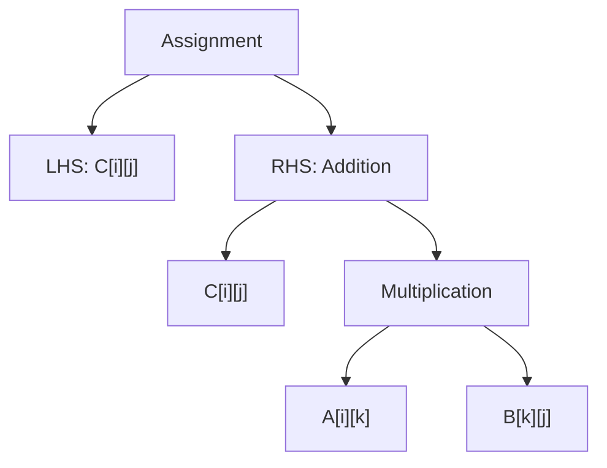

# Question 3
Describe the phases of compiler with the following example.
$C[i][j]=C[i][j]+A[i][k]*B[k][j]$

1. Lexical Analysis: The lexer breaks down the input into tokens:
	- Identifiers: C, i, j, A, k, B
	- Operators: =, +, *
	- Brackets: [ ]
2. Syntax Analysis (Parsing): The parser checks if the tokens form a valid expression according to the language grammar. It typically creates an Abstract Syntax Tree (AST).




3. Semantic Analysis: This phase checks for semantic correctness. For our example, it would:
	- Verify that C, A, and B are declared as 2D arrays
	- Check that i, j, and k are valid indices
	- Ensure types are compatible for the operations

4. Intermediate Code Generation: The compiler generates an intermediate representation. For our example, it might look like:
```Intermediate
temp1 = A[i][k]
temp2 = B[k][j]
temp3 = temp1 * temp2
C[i][j] = C[i][j] + temp3
```

5. Optimization: The compiler applies various optimizations. For matrix multiplication, it might:
```
```


