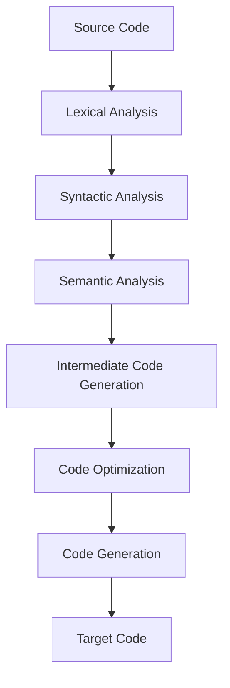
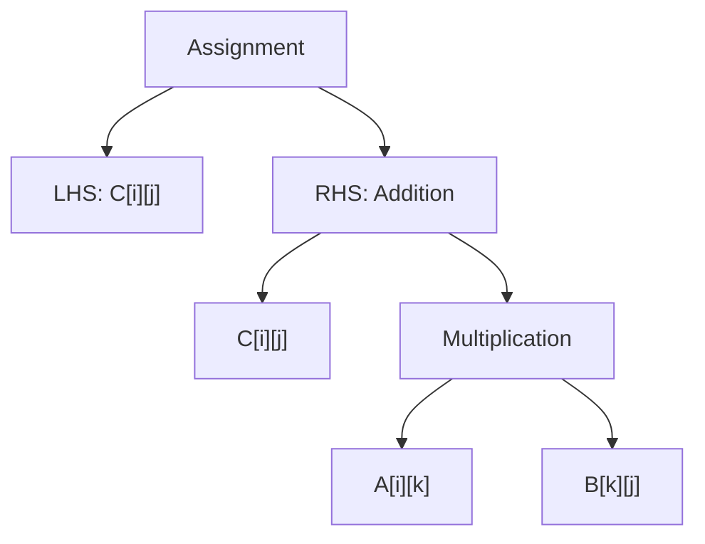
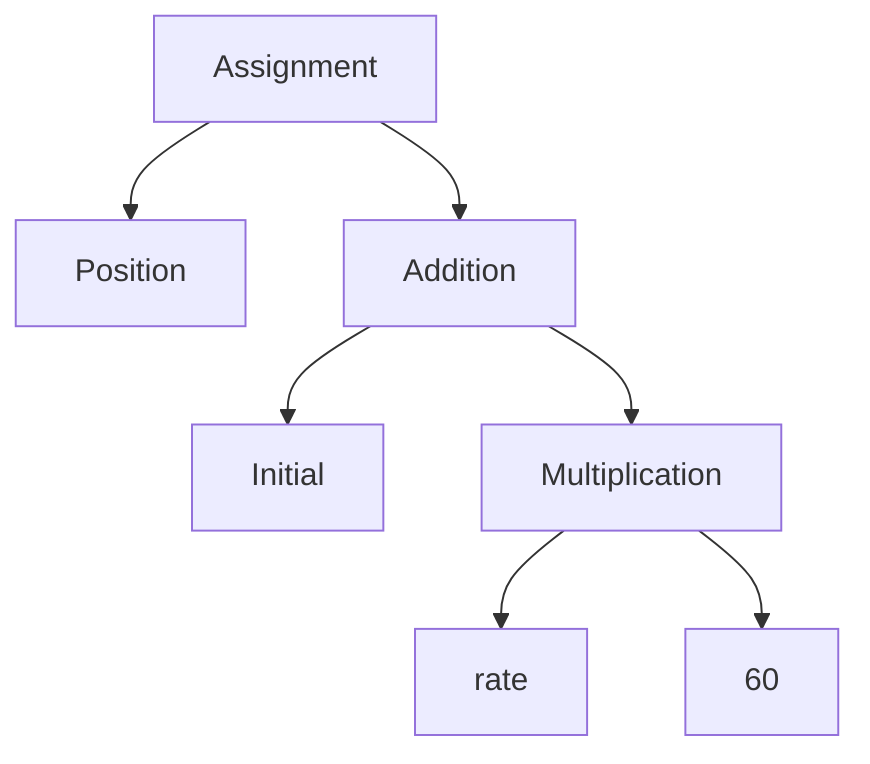

# Question 3 + 4 ⇾ Compiler Phases
## Compiler Phases:
### 1. Lexical Analysis
### 2. Syntax Analysis
### 3. Semantic Analysis
### 4. Intermediate Code Gen
### 5. Optimization
### 6. Code Gen




Describe the phases of compiler with the following example.
$C[i][j]=C[i][j]+A[i][k]*B[k][j]$

1. Lexical Analysis: The lexer breaks down the input into tokens:
	- Identifiers: C, i, j, A, k, B
	- Operators: =, +, *
	- Brackets: [ ]
2. Syntax Analysis (Parsing): The parser checks if the tokens form a valid expression according to the language grammar. It typically creates an Abstract Syntax Tree (AST).



3. Semantic Analysis: This phase checks for semantic correctness. For our example, it would:
	- Verify that C, A, and B are declared as 2D arrays
	- Check that i, j, and k are valid indices
	- Ensure types are compatible for the operations

4. Intermediate Code Generation: The compiler generates an intermediate representation. For our example, it might look like:
```Intermediate
temp1 = A[i][k]
temp2 = B[k][j]
temp3 = temp1 * temp2
C[i][j] = C[i][j] + temp3
```

5. Optimization: The compiler applies various optimizations. For matrix multiplication, it might:
```Optimized
temp4 = C[i][j]
temp1 = A[i][k]
temp2 = B[k][j]
temp3 = temp1 * temp2
temp4 = temp4 + temp3
C[i][j] = temp4
```

5. Code Generation: The compiler generates machine code or assembly. This depends on the target architecture, but it would involve:
```ASM
LOAD R1, A[i][k]      ; Load A[i][k] into register R1
LOAD R2, B[k][j]      ; Load B[k][j] into register R2
MUL R3, R1, R2        ; R3 = R1 * R2 (A[i][k] * B[k][j])
LOAD R4, C[i][j]      ; Load C[i][j] into register R4
ADD R4, R4, R3        ; R4 = R4 + R3
STORE C[i][j], R4     ; Store the result back to C[i][j]
```


1. Lexical Analysis:
	Identifiers: Position, Initial, Rate (float)
	Operators: =, +, *
	Literals: 60
2. Syntactic Analysis:
	ASM For: $Position = initial  + rate * 60$

3. Semantic Analysis:
	- Verifies that 'Position', 'initial', and 'rate' are declared variables.
	- Confirms that 'Position' is assignable.
	- Determines that 'rate' is a float (as specified in the problem).
	- Checks if 'initial' is compatible with float operations.
	- Verifies that the operations (addition and multiplication) are valid for these types.
4. Intermediate Code Generation:
```intermediate
t1 = rate * 60
t2 = initial + t1
Position = t2
```
5. Optimization:
	- If 60 is frequently used, it might get converted to a float literal
	- Multiplication might get replaced with repeated addition
	- It might re-order the code
6. Code Generation:
```ASM
MOV r0, #60              ; Load 60 into integer register
VCVT.F32.S32 f3, r0      ; Convert 60 to float
VMUL.F32 f3, f2, f3      ; Multiply rate by 60
VADD.F32 f0, f1, f3      ; Add initial to the result
VSTR f0, [r1]            ; Store result in Position (address in r1)
```

