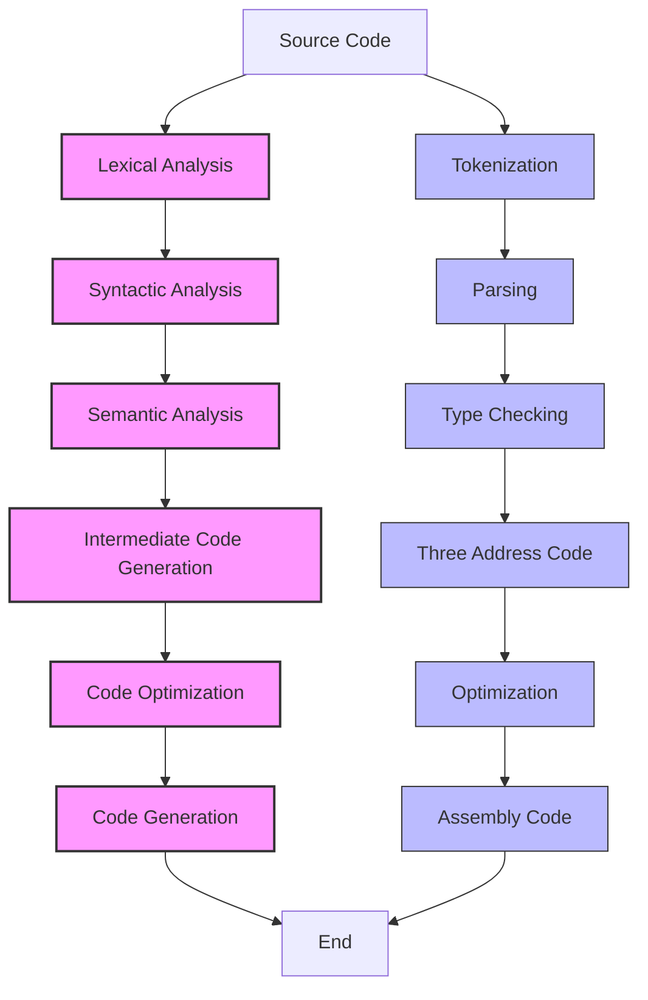

# Phases of a Compiler

```mermaid
graph TD

    A[Source Code] --> B[Lexical Analysis]

    B:::phase --> C[Syntactic Analysis]

    C:::phase --> D[Semantic Analysis]

    D:::phase --> E[Intermediate Code Generation]

    E:::phase --> F[Code Optimization]

    F:::phase --> G[Code Generation]

    G:::phase --> I[End]

  

    A --> BA[Tokenization]:::process

    BA --> CA[Parsing]:::process

    CA --> DA[Type Checking]:::process

    DA --> EA[Three Address Code]:::process

    EA --> FA[Optimization]:::process

    FA --> GA[Assembly Code]:::process

    GA --> I

  

    classDef phase fill:#f9f,stroke:#333,stroke-width:2px;

    classDef process fill:#bbf,stroke:#333,stroke-width:1px;
```

