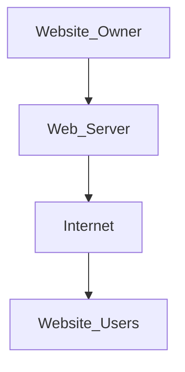

# Website
- It is a collection of web pages, and they are digital files that are written using HTML (Hyper text Markup Language).
- To make a website available to the users, they are stored (hosted) on computers which are continually connected to the internet called as **web servers**
- The webpages are linked together using hyperlinks and hypertexts (Hypertext Transfer Protocol // Secure)
- **How does a website work:** 
	Internet (web) provides ground for websites; acting like the infrastructure on which websites rely; web acts as the system that enables information.

## How a website works:
1. Enter a web address
2. Requests get sent to DNS Server
3. DNS looks up for the IPA of the server
4. Routes to the correct IPA; and uses HTTP/S to transmit the required information to the server
5. Sends the requested info to the page
6. Browser formats the webpage and displays it

## Components of Website WAHDCN
W -> Web Host
A -> Address
H -> Host
D -> Data
C -> Connection
N -> NEtwo

