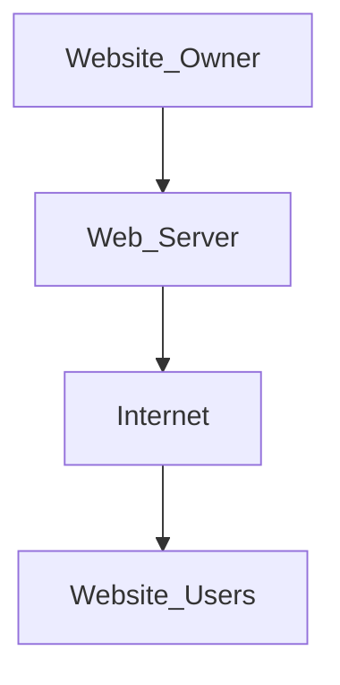

# Website
- It is a collection of web pages, and they are digital files that are written using HTML (Hyper text Markup Language).
- To make a website available to the users, they are stored (hosted) on computers which are continually connected to the internet called as **web servers**
- The webpages are linked together using hyperlinks and hypertexts (Hypertext Transfer Protocol // Secure)
- **How does a website work:** 
	Internet (web) provides ground for websites; acting like the infrastructure on which websites rely; web acts as the system that enables information.

