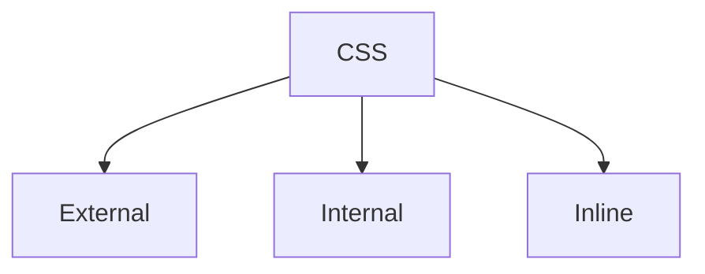

# CSS
Cascading Style Sheets


## External - Creating a style.css file
HTML:
```HTML
<link rel="stylesheet" href="style.css">
```
CSS:
```CSS
@import url('https://fonts.googleapis.com/css2?family=Montserrat:ital,wght@0,100..900;1,100..900&display=swap');

body{
    background-color: #131316;
    color: white;
    font-family: 'montserrat', sans-serif;
}

p {
    margin: 8px;
}

.nav{
    display: flex;
    position: fixed;
    align-items: center;
    z-index: 1;
}
```
## Internal - <style> </style> tag

```HTML
<html>
    <head>
	    <style>
		    @import url('https://fonts.googleapis.com/css2?family=Montserrat:ital,wght@0,100..900;1,100..900&display=swap');
			
			body{
			    background-color: #131316;
			    color: white;
			    font-family: 'montserrat', sans-serif;
			}
			
			p{
			    margin: 8px;
			}
			
			.nav{
			    display: flex;
			    position: fixed;
			    align-items: center;
			    z-index: 1;
		</style>
	</head>
<html>
}
```

## Inline - Declaring a style inside an HTML tag
```HTML
<html>
    <head>
		<script defer src="script.js"></script>
	</head>
	<body>
		<h1 style="font-size:16px;"> MWA </h1>
	</body>
<html>
}
```

## Advantages of CSS
- Flexibility
- Accessibility
- Characteristics of Presentation
- Reduces Complexity and Redundancy
- Can format multiple pages with a css file
- Making styling changes to the whole site from just one file